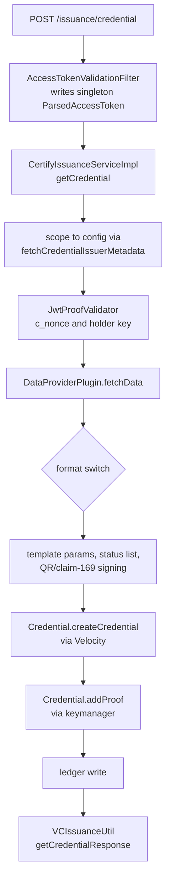
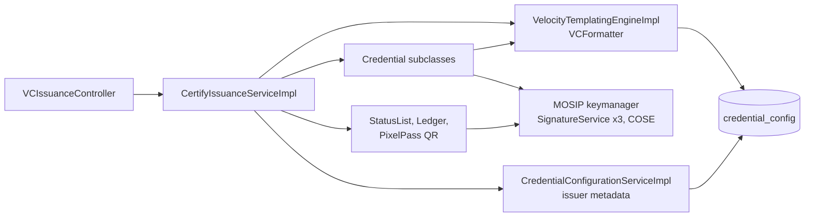
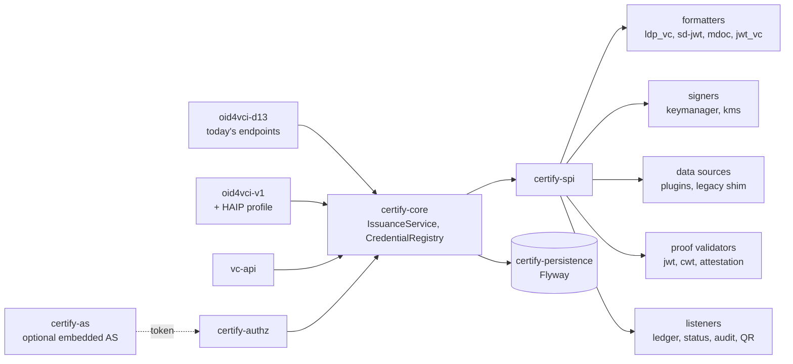
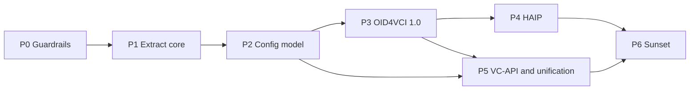

# Inji Certify Extensibility Review

As of 2026-09-18 · reviewed at commit `e54539a` (0.14.0) · live copy: https://claude.ai/code/artifact/5cf478f6-018c-4079-8825-e4a837db3323

## Executive summary

Inji Certify 0.14.0 is a working OpenID4VCI draft-13 issuer, but it is built as one protocol, one issuance mode and one signing backend fused together. A second OpenID4VCI version, a VC-API front door, a fourth credential format or a non-keymanager signer each require edits to the same five classes. The recommendation is not a feature rewrite; it is a re-layering that keeps today's endpoints, database and plugins alive as compatibility adapters over a new protocol-agnostic issuance core.

What the review found, in one line each:

- `CertifyIssuanceServiceImpl` (394 lines) does request validation, scope matching, proof checking, data fetch, template assembly, QR signing, status-list and ledger writes and signing dispatch; it is the most-edited file in the last 200 commits (27 touches).
- Credential format is a string switched in at least 8 places; the Velocity engine (`VCFormatter`) doubles as the config repository and key chooser through a `type::context::format` string key.
- Signing calls MOSIP keymanager from five separate call sites (JWS, JWS v2, raw sign, COSE/MSO, CWT); keymanager `appId`/`refId` are part of the public config API and the `credential_config` table.
- Protocol version is not a layer: `/vd11` and `/vd12` reuse the draft-13 request DTO and only relabel the response; c\_nonce, proof and metadata handling have no seam for OpenID4VCI 1.0's nonce endpoint, `credential_configuration_id`, `proofs[]`, `credentials[]`, deferred or notification endpoints.
- The two issuance modes (`mosip.certify.plugin-mode=DataProvider|VCIssuance`) are two service classes chosen at boot, so one deployment cannot mix templated and externally issued credentials.

What the rebuild looks like:

- A hexagonal split: `certify-spi` (formatter, signer and key provider, data source, proof validator, issuance listener), `certify-core` (a protocol-agnostic `IssuanceService`), one module per protocol adapter (`oid4vci-d13` = today's endpoints, `oid4vci-1.0` with a HAIP profile switch, `vc-api`), `certify-authz`, an optional `certify-as`, and `certify-app` for assembly.
- A strangler sequence: characterization tests and a Flyway baseline first; extract the core behind the existing controllers with zero API or DB change; then a JSONB config model; then the 1.0 adapter and conformance runs; then HAIP, VC-API and mode unification; deprecation sunsets last.
- A compatibility contract: every current endpoint and plugin interface keeps working for two minor releases with `Deprecation` and `Sunset` headers plus usage metrics; every DB change is additive with a backfill and a rollback script.

## Architecture as built today

Three Maven modules run as one Spring Boot process; the boot property `mosip.certify.plugin-mode` selects one of two `VCIssuanceService` beans, and in DataProvider mode every credential passes through one Velocity template and one keymanager signing call.

| Module | Holds | Notes |
| --- | --- | --- |
| `certify-integration-api` | Plugin SPI: `VCIssuancePlugin`, `DataProviderPlugin`, `AuditPlugin`; `VCRequestDto`, `VCResult` | Published for plugin authors; `VCIssuancePlugin` returns a danubetech `JsonLDObject` |
| `certify-core` | 7 service interfaces, 57 DTOs, constants, exceptions, cache config | Request/response DTOs are draft-13 shaped |
| `certify-service` | 9 controllers, 21 services, 3 format classes, 8 LD proof generators, 6 proof classes, 7 JPA entities, utils (11,094 lines) | All behaviour lives here |
| `certify-service-with-plugins` | Dockerfile layering plugin jars onto the service image | No code |
| `db_scripts`, `db_upgrade_script` | psql DDL for 12 tables; hand-run `X_to_Y_upgrade.sql` / `_rollback.sql` pairs | No Flyway or Liquibase |
| `api-test` | MOSIP test-rig (TestNG) regression suite | Runs in `push-trigger.yml` |

The credential request in DataProvider mode:



Every box from C to L is one class or one static utility, and the format decision at G is repeated inside H, I, J and L.

| Class | Lines | Responsibilities today |
| --- | --- | --- |
| `CertifyIssuanceServiceImpl` | 394 | Validate request, match scope, validate proof, fetch data, switch on format, assemble template params and expiry, sign QR entries, add status list entry, write ledger, dispatch signing |
| `VCIssuanceServiceImpl` | 169 | Same first three steps, then a format switch into `VCIssuancePlugin` |
| `VelocityTemplatingEngineImpl` | 284 | Render the template; parse the `type::context::format` key; load and cache `CredentialConfig`; expose 9 config getters; inject `id`, `credentialStatus`, `vct`, `cnf`, `iss`, render-method digest |
| `Credential`, `W3CJsonLD`, `SDJWT`, `MDocCredential` | 522 | Per-format build and sign, each calling keymanager directly |
| `VCIssuanceUtil` | 321 | Draft-11/12 metadata down-conversion, c\_nonce issue and check, scope matching, response shaping |
| `CredentialConfigurationServiceImpl` | 390 | Config CRUD and validation; issuer metadata for `latest`, `vd12`, `vd11` |
| `JwtProofValidator` | 222 | The only proof type; did:jwk and did:key resolution |
| `IarServiceImpl`, `PreAuthorizedCodeService`, `AccessTokenJwtUtil` | 1,023 | Embedded authorization server: pre-authorized code, interactive authorization (presentation during issuance), token minting |
| `StatusListCredentialService`, `StatusListUpdateBatchJob` | 559 | Bitstring status list generation, index allocation, batch re-signing |

The other HTTP surfaces are thin: config CRUD (`/credential-configurations`), discovery (`/.well-known/openid-credential-issuer`, `did.json`, `jwks.json`, `oauth-authorization-server`), embedded AS (`/oauth/iar`, `/oauth/token`, `/pre-authorized-data`, `/credential-offer-data/{id}`), status and ledger (`/credentials/status`, `/credentials/v2/status`, `/credentials/status-list/{id}`, `/ledger-search`, `/v2/ledger-search`), rendering templates and certificate upload. Persistence is 12 PostgreSQL tables, 4 of them owned by the keymanager library (`key_alias`, `key_policy_def`, `key_store`, `ca_cert_store`).

## Coupling findings

Twelve couplings explain why every extension touches the same files. Line numbers are from `certify-service/src/main/java/io/mosip/certify` at commit `e54539a`.



The template engine is the only path to configuration, and keymanager is reached from four directions; nothing sits between the HTTP layer and the storage layer.

| # | Coupling | Evidence | What it blocks |
| --- | --- | --- | --- |
| 1 | One method orchestrates issuance end to end | `CertifyIssuanceServiceImpl.java:192-316` (`getVerifiableCredential`) plus `:318-393` (`signQrEntries`); `getCredential` `:143-184` is duplicated in `VCIssuanceServiceImpl.java:75-113` | Deferred, batch, notification, response encryption and any new step land in the same method, twice |
| 2 | Format is a string switched in 8 places | `CertifyIssuanceServiceImpl.java:207-244`; `VCIssuanceServiceImpl.java:129-156`; `VCIssuanceUtil.java:210-226`, `:250-290`; `CredentialRequestValidator.java:11-18`; `CredentialConfigurationServiceImpl.java:128-156`, `:369-387`; `VelocityTemplatingEngineImpl.java:83-106`; `CredentialUtils.java:37-54`; three partial unique indexes in `certify-credential_config.sql` | `dc+sd-jwt` is accepted by the validator (`CredentialRequestValidator.java:15`) but rejected by `SDJWT.canHandle` (`SDJWT.java:55`) and by scope matching: a half-added format today |
| 3 | Template engine is also the config repository and key chooser | `VCFormatter.java` has 11 methods, 9 are config getters keyed by a `type::context::format` string; `VelocityTemplatingEngineImpl.java:75-121` parses that key per format; `:243-254` injects `id`, `credentialStatus`, `vct`, `cnf`, `iss` after rendering; `Credential.java:42-45` requires a `VCFormatter` in every format class | A second template engine, a non-templated format, or per-config key selection |
| 4 | Signing bound to keymanager from five call sites over three APIs | `Credential.java:96-115` (`jwsSign`), `SDJWT.java:115-138` (`jwsSignV2`, `typ` hard-coded to `vc+sd-jwt`), `W3CJsonLD.java:88-146` (per-suite `ProofGenerator` or `KeymanagerByteSigner`), `MDocProcessor.java:456` (COSE), `Credential.java:125-142` (CWT); `key-alias-mapper` is `@Value`-injected in 5 classes; `AppConfig.java:121-153` pre-creates fixed `CERTIFY_VC_SIGN_*` keys only in DataProvider mode; `keyManagerAppId`/`RefId` are public API fields (`CredentialConfigurationDTO.java:31-33`) | Cloud KMS or external HSM signers, per-tenant keys, rotation, `x5c`/`kid` policy; `DIDDocumentUtil` and `JwksServiceImpl` each re-derive public keys from certificates |
| 5 | Protocol version is not a layer | `VCIssuanceController.java:57-76`: `/vd11` and `/vd12` only call `setFormat` on the response; `CredentialRequest.java` is the single draft-13 DTO; metadata versions are a switch at `CredentialConfigurationServiceImpl.java:276-282` with a second, parallel converter at `VCIssuanceUtil.java:30-148`; `?version=` on `.well-known` is non-standard | OpenID4VCI 1.0 request by `credential_configuration_id`, `proofs[]`, `credentials[]`, `transaction_id`, `notification_id`, encrypted responses |
| 6 | c\_nonce and proof are draft-13 only | `VCIssuanceUtil.java:150-206` mints the nonce from the credential endpoint and throws `InvalidNonceException`; `JwtProofValidator.java:54` fixes `typ`, `:214-222` picks the key resolver by `kid` prefix; `CredentialProof.cwt` exists with no validator; no `x5c`, `trust_chain`, `key_attestation` | 1.0 `nonce_endpoint` and `invalid_nonce`; HAIP key attestation; CWT and LDP-VP proofs |
| 7 | `credential_config` is a union of every format | `CredentialConfig.java`: `context` and `credentialType` stored as sorted comma strings (`CredentialConfigMapper.java:60-68`), plus `docType`, `sdJwtVct`, `credentialSubject`, `msoMdocClaims`, `sdJwtClaims`, `sdClaim` (comma string), `qrSettings`; `CredentialConfigurationServiceImpl.java:88-90` copies global binding, signing and proof-type properties into each row at create time; `plugin_configurations` JSONB is never read | A new format means DDL, validator, mapper, index and metadata changes; no place for 1.0 `claims[].path` or `credential_metadata` |
| 8 | Issuer metadata is rebuilt per credential request | `CertifyIssuanceServiceImpl.java:156` calls `fetchCredentialIssuerMetadata("latest")`, which runs `findAll()` (`CredentialConfigurationServiceImpl.java:271`) with no `@Cacheable`; scope matching runs on the protocol DTO, not a registry | Domain lookup depends on one protocol's wire shape; N configs cost N rows per issuance |
| 9 | Request state in a singleton | `ParsedAccessToken.java:14` is a singleton `@Component` written by `AccessTokenValidationFilter.java:104-107`; `shouldNotFilter` `:89-92` is an exact-path allow-list from `mosip.certify.authn.filter-urls`; `PreAuthIssuanceServiceImpl.java:29-35` reads it as a `DataProviderPlugin` | Any second credential endpoint, VC-API, batch or async issuance; thread safety with `@EnableAsync` |
| 10 | Embedded authorization server entangled with the issuer | `OAuthController`, `IarServiceImpl`, `PreAuthorizedCodeService`, `AccessTokenJwtUtil` share `VCICacheService` and signing keys with issuance; `PreAuthIssuanceServiceImpl.java:18-19` plugs the AS into the data-provider slot | HAIP's PAR, DPoP and wallet attestation; running behind an external AS only; splitting AS from issuer |
| 11 | Side effects inline and mutating plugin data | `addCredentialStatus(jsonObject, …)` `:221` edits the fetched JSON before templating, only for `ldp_vc` + VC 2.0; `jsonObject.remove(credentialStatus)` `:304`; ledger `:290-301`; QR `:278-287` | Token Status List for SD-JWT and mDoc, notification endpoint, audit and webhooks as plugins |
| 12 | Plugin SPI is format-shaped and leaks library types | `VCIssuancePlugin.java:31-42` splits two methods by return type and exposes danubetech `JsonLDObject`; `VCRequestDto` is a union of format fields; `DataProviderPlugin.fetchData(Map)` receives raw token claims plus an injected `accessTokenHash` (`:193`); one bean per deployment via `scan-base-package` and `@ConditionalOnProperty` | Several data sources per issuer, per-config plugin selection, SPI versioning |

Test coverage matches the shape: 55 Mockito-style unit test classes, a TestNG `api-test` rig, no architecture rules, no plugin contract tests, no conformance run.

## Capability gaps and their root cause

Every gap on the roadmap traces to two or three of the twelve couplings, and four of them (1, 2, 4, 5) appear under almost every row.

| Capability | What it needs | Breaks on | Root cause |
| --- | --- | --- | --- |
| OpenID4VCI 1.0 (final) alongside draft 13 | Request by `credential_configuration_id` or `credential_identifier`; `proofs` keyed by proof type; `credentials[]` response with `transaction_id`; `nonce_endpoint`; `deferred_credential_endpoint`; `notification_endpoint`; request and response encryption; `batch_credential_issuance`; `claims[].path`; `credential_metadata`; `dc+sd-jwt` | 1, 2, 5, 6, 7 | `CredentialRequest`, `CredentialResponse` and the metadata DTOs are one draft's wire shape living in `certify-core`; there is no adapter layer to hold a second shape |
| Two protocol versions live at once | Separate request parsers, metadata renderers, error maps and nonce strategies, mounted either under distinct `credential_issuer` identifiers or behind one endpoint that dispatches on request shape | 5, 8, 9 | Version handling is a `?version=` parameter on metadata and a response relabel on `/vd11`, `/vd12`; the auth filter is an exact-path allow-list |
| HAIP profile | `dc+sd-jwt` and `mso_mdoc` only; JWT proof with `key_attestation`; wallet (client) attestation, PAR and PKCE at the AS; DPoP-bound access tokens; nonce endpoint; encrypted credential responses (check the HAIP revision you target) | 4, 6, 10 | Proof validation is one class with `kid`-prefix dispatch; the embedded AS has neither PAR, DPoP nor attestation and is wired into the data-provider slot; the SD-JWT signer hard-codes `typ: vc+sd-jwt` |
| VC-API issuer (`POST /credentials/issue` with `credential` + `options`, `POST /credentials/status`) | Client-level auth (OAuth2 client credentials or mTLS), no holder binding, caller-supplied credential body, key selection by `options.verificationMethod` | 1, 3, 4, 9 | No core operation to sign a supplied payload without a template name; `ParsedAccessToken` assumes a holder token; today's `POST /credentials/status` is Certify's own revocation API with a different body, so the VC-API path must be namespaced |
| New formats in DataProvider mode (`jwt_vc_json`, `dc+sd-jwt`, `ecdsa-sd-2023`, BBS) | One place to register format id, aliases, config schema, request validation, metadata fragment, build and sign | 2, 3, 7 | Format knowledge is spread over eight switches, three DB indexes, three validators and the template-key parser |
| New proof types and holder key forms (`cwt`, `ldp_vp`, `attestation`; `x5c`, `jwk` thumbprint, `did:web`) | `ProofValidator` per type returning a typed `HolderBinding`; `HolderKeyResolver` per key form | 6 | `getKeyMaterial` returns a DID string; `JwtProofKeyManager` is chosen by string prefix inside the validator |
| Alternate signers (cloud KMS, external HSM, remote signing) and multi-issuer keys | `Signer` + `KeyProvider` SPI; opaque `KeyRef` in config; one key registry feeding JWKS and DID documents | 4, 7 | Keymanager `appId`/`refId` are domain, API and DB vocabulary; five call sites; `AppConfig.initKeys` owns key creation |
| Status beyond Bitstring (IETF Token Status List for SD-JWT and mDoc; VC 1.1 status) | `StatusProvider` SPI invoked per format after build, before sign | 11 | Status is inlined for `ldp_vc` + VC 2.0 only and mutates the data-provider JSON |
| Deferred, batch and notification issuance | Persisted `issuance_transaction` with state; async completion; per-credential `notification_id` | 1, 9 | The only transaction record is a cache entry keyed by access-token hash |
| Templated and externally issued credentials in one deployment | Per-configuration issuance strategy | 1, 12 | Mode is a boot-time `@ConditionalOnProperty` on two service classes |
| Second template engine, or no template | `TemplateEngine` SPI with the config lookup removed from it | 3 | `VCFormatter` is the config accessor for the whole service |

## Target architecture

A hexagonal core with a single `IssuanceService.issue(IssuanceCommand)` operation, protocol adapters on the outside, and every varying concern (format, signing, data, proof, status, template) behind an SPI in its own module. The core imports no Spring Web, JPA, keymanager, Velocity or danubetech types.



Arrows point inward only: adapters know the core, the core knows the SPI, and implementations know nothing above them.

| Module | Contains | May depend on |
| --- | --- | --- |
| `certify-spi` | Interfaces and value types below; semver-versioned, published for plugin authors | JDK only |
| `certify-core` | `IssuanceService`, `CredentialRegistry`, `CredentialConfiguration` domain model, `IssuanceContext`, nonce and transaction ports | `certify-spi` |
| `certify-persistence` | JPA entities, repositories, Flyway migrations, implementations of the core's storage ports | `certify-core` |
| `certify-authz` | Bearer token validation to a request-scoped `AuthorizationContext`; scope and `authorization_details` policy | `certify-core` |
| `certify-protocol-oid4vci-d13` | Today's controllers and DTOs moved out of `certify-core`; c\_nonce-in-token strategy; draft-11/12 metadata down-converters | `certify-core`, `certify-authz` |
| `certify-protocol-oid4vci-v1` | 1.0 controllers and DTOs; nonce, deferred and notification endpoints; encryption; `profile=haip` switch that tightens formats, proofs and AS requirements | `certify-core`, `certify-authz` |
| `certify-protocol-vcapi` | `/vc-api/credentials/issue`, `/vc-api/credentials/status`; client-credential auth | `certify-core` |
| `certify-as` | Pre-authorized code, IAR, token endpoint, AS metadata; later PAR, DPoP, wallet attestation | `certify-core` (for offers), `certify-persistence` |
| `certify-format-*`, `certify-signer-keymanager`, `certify-status-bitstring`, `certify-listener-*` | One implementation each | `certify-spi` |
| `certify-integration-api` (kept) | Old `DataProviderPlugin`, `VCIssuancePlugin`, `AuditPlugin` plus adapters that wrap them into the new SPI | `certify-spi` |
| `certify-app` | Spring Boot assembly, plugin discovery, property binding | everything |

The SPI, sketched:

```java
// certify-spi
public interface CredentialFormatter {
    String formatId();                                   // "ldp_vc", "dc+sd-jwt", "mso_mdoc", "jwt_vc_json"
    Set<String> aliases();                               // {"vc+sd-jwt"}: accepted, never advertised
    FormatConfig parseConfig(Map<String, Object> raw);   // typed and validated per format
    Map<String, Object> metadataFragment(CredentialConfiguration cfg, ProtocolVersion v);
    UnsignedCredential build(ClaimSet claims, CredentialConfiguration cfg, IssuanceContext ctx);
    IssuedCredential sign(UnsignedCredential c, SigningKey key, Signer signer);
}

public interface Signer {
    byte[] sign(byte[] data, SigningKey key);
    String jws(byte[] payload, Map<String, Object> header, SigningKey key);
    byte[] cose(byte[] payload, Map<Integer, Object> protectedHeader, SigningKey key);
}

public interface KeyProvider {
    SigningKey resolve(KeyRef ref);                      // ref = provider, alias, alg, cryptosuite
    List<PublicKeyDescriptor> publicKeys();              // the one source for JWKS and DID documents
}

public interface CredentialDataSource {
    String id();
    ClaimSet fetch(IssuanceContext ctx, CredentialConfiguration cfg) throws DataSourceException;
}

public interface ExternalIssuer {                        // successor of VCIssuancePlugin
    IssuedCredential issue(IssuanceContext ctx, CredentialConfiguration cfg);
}

public interface ProofValidator {
    String proofType();                                  // "jwt", "cwt", "ldp_vp", "attestation"
    HolderBinding validate(ProofInput proof, ProofPolicy policy, NonceCheck nonce);
}

public interface StatusProvider {
    String mechanism();                                  // "BitstringStatusList", "TokenStatusList"
    UnsignedCredential attach(UnsignedCredential c, CredentialConfiguration cfg);
    void update(StatusUpdate update);
}

public interface IssuanceListener {
    default void beforeSign(UnsignedCredential c, IssuanceContext ctx) {}
    default void onIssued(IssuanceEvent e) {}
    default void onFailed(IssuanceFailure f) {}
}

public interface TemplateEngine {
    String render(Template template, Map<String, Object> model);
}

// certify-core
public record IssuanceCommand(String credentialConfigurationId,
                              AuthorizationContext authz,
                              Optional<ProofInput> proof,
                              Optional<Map<String, Object>> suppliedCredential,   // VC-API path
                              Map<String, Object> protocolParams) {}

public sealed interface IssuanceResult permits Issued, Deferred {}
```

`HolderBinding` is Certify's own type (`kind` = DID, JWK, COSE\_KEY or NONE; `value`; `kid`), so no nimbus or danubetech class crosses the SPI. `ClaimSet` is a map plus provenance metadata. `KeyRef` is opaque to the core; the keymanager `KeyProvider` maps it to today's `appId`/`refId`.

The core flow, in order:

1. `CredentialRegistry.resolve(command)` returns one `CredentialConfiguration` by id, or by (format, selector) for draft-13 requests.
2. `AuthorizationPolicy.check(authz, cfg)` enforces scope or `authorization_details`.
3. If the configuration requires holder binding, the `ProofValidator` for the proof type returns a `HolderBinding`; nonce checking is a strategy injected by the adapter (token-carried for d13, nonce endpoint for 1.0).
4. Strategy from the configuration: `TEMPLATE` (data source, then formatter build), `EXTERNAL` (`ExternalIssuer`), or `SUPPLIED` (VC-API payload straight to formatter).
5. `StatusProvider.attach` if the configuration names a status mechanism.
6. `IssuanceListener.beforeSign` (QR/claim-169, render-method digest live here as listeners, not in the core).
7. `formatter.sign(unsigned, keyProvider.resolve(cfg.signing()), signer)`.
8. `IssuanceListener.onIssued` (ledger, audit, notification bookkeeping), then `IssuanceResult`.

The domain configuration model replaces the union entity:

```java
public record CredentialConfiguration(
    String id,                       // today's credential_config_key_id
    String scope,
    String format,                   // canonical formatter id
    FormatConfig formatConfig,       // typed by the formatter: context+types, vct, doctype, claims, sdClaims, template
    SigningConfig signing,           // KeyRef + alg + cryptosuite; no appId/refId
    IssuanceStrategy strategy,       // TEMPLATE | EXTERNAL | SUPPLIED, plus dataSourceId
    StatusConfig status,             // mechanism + purposes, or none
    DisplayConfig display,
    Map<ProtocolVersion, Map<String, Object>> protocolOverrides) {}
```

Protocol adapters and mounting:

| Adapter | Mount | Notes |
| --- | --- | --- |
| `oid4vci-d13` | Unchanged: `/issuance/credential`, \`/issuance/vd11 | vd12/credential` ,  `/.well-known/openid-credential-issuer?version=\` |
| `oid4vci-v1` | `credential_issuer` = `{domain}{servletPath}/oid4vci`; endpoints `/oid4vci/credential`, `/oid4vci/nonce`, `/oid4vci/deferred_credential`, `/oid4vci/notification`; metadata served at both RFC 8615 path forms | HAIP is a profile switch on this adapter, not a fourth adapter |
| `vc-api` | `/vc-api/credentials/issue`, `/vc-api/credentials/status` | Namespaced to avoid the existing `POST /credentials/status` |
| `certify-as` | Unchanged `/oauth/*`, `/pre-authorized-data`, `/credential-offer-data/{id}` | Deployable in the same JVM or split out; issuer never reads AS caches directly |

Plugin loading and SPI versioning: implementations are discovered through Spring `AutoConfiguration.imports` (or `ServiceLoader` for non-Spring jars) instead of `scan-base-package`; `certify-spi` follows semver with `@since` on every method; `certify-integration-api` stays published and its `LegacyDataProviderAdapter` and `LegacyExternalIssuerAdapter` wrap old plugins for at least two minor releases.

Rules to enforce with ArchUnit from Phase 0: `certify-core` has no dependency on `org.springframework.web`, `jakarta.servlet`, `jakarta.persistence`, `io.mosip.kernel`, `org.apache.velocity`, `com.danubetech`, `foundation.identity`; adapters depend only on `certify-core` and `certify-authz`; `VCFormats` constants are referenced only inside `certify-spi` and formatter modules.

## Database and migration path

The schema can stay in place: every change is an added column or table with a backfill, and the only destructive step (dropping the per-format columns of `credential_config`) waits for the sunset release. Adopt Flyway with a `0.14.0` baseline first so existing databases are recognised without being touched.

Today: 12 tables, 8 owned by Certify (`credential_config`, `rendering_template`, `status_list_credential`, `status_list_available_indices`, `ledger`, `credential_status_transaction`, `shedlock`, `iar_session`) and 4 by the keymanager library. Upgrades are hand-run `X_to_Y_upgrade.sql` / `_rollback.sql` pairs under `db_upgrade_script`, with `spring.jpa.hibernate.ddl-auto=none`.

| Table | Change | Why |
| --- | --- | --- |
| `credential_config` | Add `format_config JSONB`, `signing_config JSONB`, `issuance_strategy VARCHAR(16) DEFAULT 'TEMPLATE'`, `data_source_id VARCHAR(128)`, `status_config JSONB`, `protocol_overrides JSONB`, `config_version SMALLINT DEFAULT 1`; backfill in the same migration | Holds the domain model from the target architecture; legacy columns stay for the three partial unique indexes until sunset |
| `credential_config` (sunset) | Drop `context`, `credential_type`, `doctype`, `sd_jwt_vct`, `sd_claim`, `credential_subject`, `mso_mdoc_claims`, `sd_jwt_claims`, `vc_template`, `did_url`, `key_manager_app_id`, `key_manager_ref_id`, `signature_algo`, `signature_crypto_suite`, `plugin_configurations`; replace the three indexes with one unique index on `(credential_format, selector_key)` where `selector_key` is a generated column from `format_config` | `plugin_configurations` is never read today; one index per format is the DB half of the format switch |
| `issuance_transaction` (new) | `id UUID`, `access_token_hash`, `credential_config_id`, `protocol_version`, `state` (PENDING, ISSUED, DEFERRED, FAILED, NOTIFIED), `holder_binding JSONB`, `c_nonce`, `c_nonce_expires_at`, `notification_id`, `credential_ids TEXT[]`, `cr_dtimes`, `expires_at` | Replaces the cache-only `vcissuance` transaction; needed for deferred, batch and notification |
| `nonce` (new, or Redis) | `value` PK, `client_id`, `issued_at`, `expires_at`, `consumed_at` | Single-use nonces for the 1.0 nonce endpoint across nodes |
| `credential_offer` (new, owned by `certify-as`) | `offer_id` PK, `payload JSONB`, `pre_auth_code_hash`, `tx_code_hash`, `expires_at`, `used_at` | Today offers live only in a 600 s cache |
| `ledger` | Add `credential_config_id`, `format`, `protocol_version`, `transaction_id` | Search and revocation by configuration and format, not only by type string |
| `status_list_credential` | Add `mechanism VARCHAR(64) DEFAULT 'BitstringStatusList'` and `format VARCHAR(32)`; `vc_document` holds the serialized artefact for either mechanism | Token Status List (IETF) for SD-JWT and mDoc alongside Bitstring |
| `iar_session`, keymanager tables, `rendering_template`, `shedlock` | No change | `iar_session` moves under `certify-as` ownership; keymanager tables belong to the library |

Backfill for `credential_config`, in the same migration as the new columns:

```sql
UPDATE certify.credential_config SET
  format_config = jsonb_strip_nulls(jsonb_build_object(
    'context', string_to_array(context, ','), 'types', string_to_array(credential_type, ','),
    'vct', sd_jwt_vct, 'doctype', doctype, 'template', vc_template,
    'sdClaims', string_to_array(sd_claim, ','), 'credentialSubject', credential_subject,
    'mdocClaims', mso_mdoc_claims, 'sdJwtClaims', sd_jwt_claims)),
  signing_config = jsonb_build_object('provider', 'keymanager',
    'alias', jsonb_build_object('appId', key_manager_app_id, 'refId', key_manager_ref_id),
    'alg', signature_algo, 'cryptosuite', signature_crypto_suite, 'didUrl', did_url),
  status_config = CASE WHEN credential_status_purpose IS NULL THEN NULL
    ELSE jsonb_build_object('mechanism', 'BitstringStatusList', 'purposes', to_jsonb(credential_status_purpose)) END,
  config_version = 2
WHERE config_version = 1;
```

Rules that keep an upgrade safe: the read path prefers JSONB when `config_version >= 2` and falls back to legacy columns otherwise; the v1 config API writes both shapes; the v2 config API writes JSONB and derives the legacy columns until sunset; each Flyway version ships with a matching rollback script in `db_upgrade_script` because Flyway Community has no undo; nothing is renamed before the sunset release.

| Release | Migration | Additive | Rollback |
| --- | --- | --- | --- |
| 0.15 | Flyway baseline at 0.14.0; no schema change | yes | none needed |
| 0.16 | `credential_config` JSONB columns and backfill; `issuance_transaction`; `ledger` columns | yes | drop the added columns and table |
| 0.17 | `nonce`, `credential_offer`; `status_list_credential.mechanism` | yes | drop |
| 1.0 | Drop legacy `credential_config` columns; new selector index | no | reverse backfill script, run after a backup |

## API compatibility and deprecation

Every endpoint in 0.14.0 keeps its path, request and response bytes through 0.15 and 0.16; a deprecated endpoint answers with `Deprecation` and `Sunset` headers and a usage counter, and is removed no earlier than two minor releases after its replacement shipped.

| Endpoint | Today | Decision | Replacement | Removal |
| --- | --- | --- | --- | --- |
| `POST /issuance/credential` | Draft-13 credential endpoint | Keep as the `oid4vci-d13` adapter; optional flag to also accept 1.0-shaped requests | none | none while draft-13 wallets exist |
| `POST /issuance/vd12/credential`, `POST /issuance/vd11/credential` | Same handler, response relabel only | Deprecate in 0.15 | `POST /issuance/credential` | 1.0 |
| `GET /.well-known/openid-credential-issuer` | Draft-13 metadata; \`?version=vd11 | vd12\` | Keep; deprecate the `version` parameter in 0.15 | 1.0 metadata under the `/oid4vci` issuer identifier |
| `GET /issuance/.well-known/openid-credential-issuer`, `GET /issuance/.well-known/did.json` | Already `@Deprecated` in code, no headers | Add headers in 0.15 | Root `/.well-known/*` | 0.17 |
| `GET /.well-known/did.json`, `GET /.well-known/jwks.json` | Derived separately from keymanager certificates | Keep; both served from `KeyProvider.publicKeys()` | none | none |
| `GET /.well-known/oauth-authorization-server`, `POST /oauth/iar`, `POST /oauth/token` | Embedded AS | Keep; move to `certify-as`; add `POST /oauth/par` and DPoP in 0.17 | none | none |
| `POST /pre-authorized-data`, `GET /credential-offer-data/{id}` | Offer creation and retrieval | Keep in `certify-as`; offers persisted in 0.17 | none | none |
| `/credential-configurations` (POST, GET, PUT, DELETE) | Union-of-formats DTO | Keep as v1, writing both DB shapes; add `/v2/credential-configurations` in 0.16 with the domain model; deprecate v1 in 0.17 | v2 | 1.0 |
| `POST /credentials/status` | Superseded by `/credentials/v2/status` | Deprecate in 0.15 | v2 | 1.0 |
| `POST /credentials/v2/status`, `GET /credentials/status-list/{id}` | Revocation and status list | Keep; backed by `StatusProvider` | none | none |
| `POST /ledger-search` | Superseded by `/v2/ledger-search` | Deprecate in 0.15 | v2 | 1.0 |
| `GET /rendering-template/{id}`, `/system-info/*` | Templates and certificates | Keep | none | none |
| New in 0.16 and 0.17 |  | `/oid4vci/credential`, `/oid4vci/nonce`, `/oid4vci/deferred_credential`, `/oid4vci/notification`, `/oid4vci/.well-known/openid-credential-issuer`; `/vc-api/credentials/issue`, `/vc-api/credentials/status` |  |  |

Plugin and property compatibility follow the same rule. `certify-integration-api` 0.14 interfaces stay published; `LegacyDataProviderAdapter` and `LegacyExternalIssuerAdapter` wrap them into the new SPI. `mosip.certify.integration.data-provider-plugin` is honoured and mapped to a `CredentialDataSource` whose id is the bean name; `mosip.certify.plugin-mode` becomes the default `issuance_strategy` for configurations that do not set one. Old property names resolve through an `EnvironmentPostProcessor` alias table with a one-time warning; `mosip.certify.authn.filter-urls` is replaced by matchers each adapter registers, with the old list still honoured. All three are removed in 1.0.

Mechanics for every deprecated surface:

- Headers `Deprecation: @<unix-time>` (RFC 9745), `Sunset: <HTTP-date>` (RFC 8594) and `Link: <docs-url>; rel="deprecation"`.
- Micrometer counter `certify.deprecated.calls{endpoint}` and a warning log at most once per hour per endpoint, so operators can see who still calls what before removal.
- A per-endpoint kill switch `mosip.certify.deprecated.<name>.enabled=false` so a deployment can rehearse the removal.
- `deprecated: true` in `docs/inji-certify-openapi.yaml`, and a "Deprecated in this release / Removed in this release" section in `docs/RELEASES.md` every release.
- Characterization tests recorded from 0.14.0 lock the exact JSON of the draft-13 adapter, including `format` appearing only on `/vd11` and `/vd12`, `acceptance_token`, and `c_nonce` on `invalid_proof` errors.

## Compliance and conformance testing

The OpenID Foundation conformance suite is the gate for OpenID4VCI 1.0 and HAIP; draft 13 has no official suite, so it is held by characterization tests and interop wallets; VC-API is covered by the W3C CCG issuer test suite. All of them run against one `conformance` Spring profile that seeds deterministic data and configurations.

| Target | Tool | Checks | Cadence |
| --- | --- | --- | --- |
| OpenID4VCI 1.0 issuer | OpenID Foundation conformance suite, self-hosted from its Docker image in CI (confirm the current issuer test-plan names and whether the release you pin covers 1.0 final or ID2) | Issuer metadata, nonce endpoint, credential request and response shapes, proof validation, error codes, deferred and notification when advertised | Nightly; certification submission once green |
| HAIP | Same suite, HAIP profile plan | `dc+sd-jwt` and `mso_mdoc` output, key attestation in proofs, PAR, PKCE, DPoP and wallet attestation at the AS, encrypted responses | Nightly with `profile=haip` and `certify-as` PAR/DPoP on |
| Draft 13 (today's wallets) | Characterization tests recorded from 0.14.0 (REST-assured golden files) plus interop runs with Inji Wallet/mimoto and two third-party wallets | Byte-exact responses of the `oid4vci-d13` adapter | Per PR (golden files); weekly (wallet interop) |
| VC-API issuer | W3C CCG `vc-api-issuer-test-suite` (Node) | `/credentials/issue` request and `options` handling, error codes, VC 2.0 plus Data Integrity output | Nightly |
| Format validity | SD-JWT verified with `authlete/sd-jwt` (already a dependency) and `sd-jwt-vc` vectors; mDoc decoded and verified with an independent library in a test module; Data Integrity checked against W3C vectors for `eddsa-rdfc-2022`, `ecdsa-rdfc-2019`; VC 2.0 JSON Schema | Signed artefacts verify with code Certify did not write | Per PR |
| Plugin SPI | `certify-spi-testkit`: a contract test each plugin repo runs against its `CredentialDataSource`, `ExternalIssuer` or `CredentialFormatter` | Behaviour on missing claims, exceptions, timeouts, nulls | In each plugin repo's CI |
| Architecture | ArchUnit rules from the target architecture section | Dependency direction, no format constants outside formatters | Per PR |
| Regression | Existing `api-test` TestNG rig | Draft-13 adapter, config API, status and ledger | Per push, as today in `push-trigger.yml` |

The `conformance` profile: in-memory or mock `CredentialDataSource` with fixed claims, embedded AS enabled, `dc+sd-jwt`, `mso_mdoc` and `ldp_vc` configurations pre-seeded by Flyway test migrations, short-lived keys generated at boot, and the issuer URL set to the address the suite container can reach (`host.docker.internal` when self-hosted).

Test pyramid for the rebuilt code:

1. Unit: formatters, proof validators and signers with a fake `Signer`, driven by spec test vectors.
2. Component: `IssuanceService` with an in-memory `CredentialRegistry` and fake SPI implementations, no Spring context.
3. Adapter: MockMvc golden tests per protocol module; one golden set per protocol version.
4. End to end: docker-compose plus the conformance and interop jobs above.

## Phased roadmap

Seven phases, each shippable as a minor release behind the existing API; Phase 1 changes no behaviour, no endpoint and no table, and everything new arrives from Phase 3. Effort figures are rough estimates in engineer-weeks for a team of two to three who know the code.



| Phase | Release | Work packages | Exit criteria | Effort |
| --- | --- | --- | --- | --- |
| P0 Guardrails | 0.15 | Golden request/response tests for every endpoint; Flyway baseline `V0_14_0`; ArchUnit module; deprecation headers, counters and kill switches on `/vd11`, `/vd12`, `?version`, `/issuance/.well-known/*`, v1 status, v1 ledger-search; request-scoped `AuthorizationContext` with `ParsedAccessToken` as a delegating shim; `CredentialRegistry` read path replacing per-request `findAll()` | Golden tests green; Flyway adopts a 0.14 database with no diff; no wallet-visible change | 3 to 4 |
| P1 Extract core | 0.15 or 0.16 | `certify-spi` and `certify-core`; `CredentialFormatter` for `ldp_vc`, SD-JWT (`dc+sd-jwt` canonical, `vc+sd-jwt` alias) and `mso_mdoc` moved out of the `Credential` classes; `VCFormatter` reduced to `TemplateEngine`; `Signer` and `KeyProvider` over keymanager with all five signing paths routed through them; JWKS and DID document from `publicKeys()`; `ProofValidator` returning `HolderBinding`; listeners for ledger, audit, QR and render-method digest; Bitstring `StatusProvider`; `oid4vci-d13` adapter from the existing controllers; both `*IssuanceServiceImpl` classes deleted; legacy plugin adapters; core component tests | Golden tests unchanged; `api-test` passes in both plugin modes; zero DB change | 6 to 8 |
| P2 Config model | 0.16 | Migration with JSONB columns, backfill, `issuance_transaction`, ledger columns; registry reads JSONB; per-configuration `issuance_strategy`; `/v2/credential-configurations` with typed `FormatConfig`; v1 dual-write; global metadata properties merged at render time instead of copied into rows | Mixed-mode deployment test passes; upgrade and rollback rehearsed on a 0.14 dump | 3 to 4 |
| P3 OpenID4VCI 1.0 | 0.16 or 0.17 | `certify-protocol-oid4vci-v1`: metadata with `claims[].path`, `credential_metadata`, `nonce_endpoint`, `deferred_credential_endpoint`, `notification_endpoint`, `batch_credential_issuance`; requests by `credential_configuration_id`; `proofs`; `credentials[]`; nonce endpoint and store; deferred and notification on `issuance_transaction`; response encryption; conformance job in CI | OpenID Foundation suite green for the chosen 1.0 plan | 5 to 6 |
| P4 HAIP | 0.17 | `key_attestation` and `attestation` proof validation; PAR, DPoP and wallet attestation in `certify-as` or a documented external-AS contract; profile switch restricting formats and algorithms; mDoc namespace and doctype rules | HAIP conformance plan green | 4 to 5 |
| P5 VC-API and unification | 0.17 or 0.18 | `certify-protocol-vcapi` with the `SUPPLIED` strategy and client-credential auth; `ExternalIssuer` final with `VCIssuancePlugin` as adapter only; Token Status List provider; plugin discovery via `AutoConfiguration.imports`; `certify-spi-testkit` | W3C CCG issuer suite green; a plugin from `digital-credential-plugins` runs unmodified through the legacy adapter, then again after migrating to the new SPI | 4 to 5 |
| P6 Sunset | 1.0 | Remove `/vd11`, `/vd12`, `?version`, v1 config API, v1 status and ledger-search, `plugin-mode`, `filter-urls`, legacy plugin adapters (or hold one release if counters show traffic); drop legacy `credential_config` columns; delete the `VCIssuanceUtil` converters | Counters at zero for one release before each removal | 2 |

Ordering rules: P0 lands before any refactor PR; P1 is a sequence of small PRs, each keeping the golden tests green; P3 and P5 share `issuance_transaction` and the nonce store, so P5 starts only after P3's schema is merged; P6 removes nothing whose replacement is younger than two minor releases.

## Risks, open questions and decisions needed

The two largest risks are silent wallet breakage during Phase 1 and the HAIP authorization-server work landing in the wrong product; both are cheap to close early.

| Risk | Impact | Mitigation |
| --- | --- | --- |
| Golden tests miss behaviour a wallet relies on (error bodies, header casing, `format` echo) | Phase 1 breaks a live wallet | Record goldens from real Inji Wallet and mimoto traffic, not only hand-written cases; run wallet interop weekly from P0 |
| A new `credential_issuer` for 1.0 breaks wallets with cached metadata | Adoption of the 1.0 adapter stalls | Ship the dual-shape flag on the draft-13 endpoint as an alternative mount; document both |
| Keymanager stays the only `Signer` and its DTOs leak back across the seam | The signing SPI becomes decorative | ArchUnit rule from P0; a second `Signer` (JCA over a PKCS#12) in the testkit from P1 |
| HAIP's PAR, DPoP and wallet attestation belong to the AS, which in production may be eSignet | P4 effort spent on `certify-as` that deployments will not use | Decide the target AS before P4; if eSignet, P4 ships the issuer half plus a written AS contract |
| Dual-write of config v1 and v2 drifts | Wrong metadata for some configurations | One write-through service; a migration-verifier test that compares legacy and JSONB reads for every row |
| Plugin authors stay on `certify-integration-api` | Legacy adapters cannot be removed in 1.0 | Two-release guarantee, `certify-spi-testkit`, a mechanical mapping table in the migration guide |
| Presentation during issuance (IAR) is a draft extension that 1.0 may not carry | Core shaped around an unstable flow | Keep IAR in `certify-as` behind a feature flag; the core never depends on it |
| Re-layering turns into feature work | P1 slips and cannot be released | Rule: P1 ships zero behaviour change; new capability only from P3 |
| Sonar and coverage gates in `push-trigger.yml` reject large refactor PRs | P1 lands as one risky PR | Per-module coverage targets; P1 as a sequence of PRs each under the golden tests |
| `ParsedAccessToken` touches every service | Request-scope change is hard to land late | Do it in P0 with a delegating shim |

Decisions needed from the team before P2:

- [ ] Can the OpenID4VCI 1.0 `credential_issuer` be a new URL (`…/oid4vci`), or must the existing identifier serve both versions?
- [ ] Which HAIP revision is the target, and is the embedded `certify-as` or eSignet the authorization server for it?
- [ ] Do any deployments need templated and externally issued credentials in one instance within two releases (sets the order of P2 and P5)?
- [ ] Which draft-13 endpoints carry live traffic today (turn the P0 counters on before choosing 0.17 removals)?
- [ ] Keep Velocity as the only template engine, or add a JSON claims-mapping engine for SD-JWT and mDoc where templates are pass-through?
- [ ] Is presentation during issuance a product commitment or an experiment?
- [ ] Status for SD-JWT and mDoc: IETF Token Status List, or Bitstring referenced from a `status` claim?
- [ ] Are several `credential_issuer` identifiers in one deployment (multi-tenant issuers) in scope for the target model?
