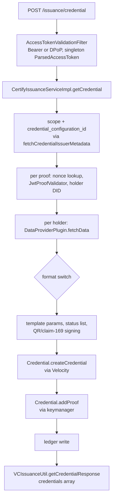
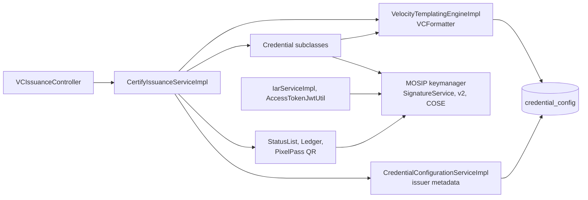
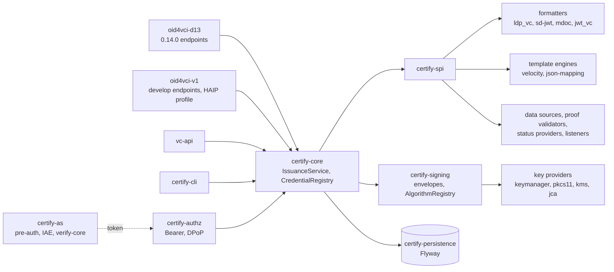
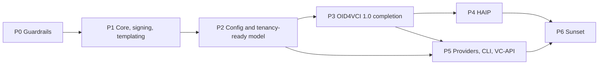

# Inji Certify Extensibility Review

As of 2026-09-18 · reviewed against `inji/inji-certify` `develop` at commit `a1cfd63` (1.0.0-beta.1-SNAPSHOT, 2026-09-17), compared with 0.14.0 (`e54539a`) · live copy: https://claude.ai/code/artifact/5cf478f6-018c-4079-8825-e4a837db3323

## Executive summary

This review covers `inji/inji-certify` at `develop` commit `a1cfd63` (2026-09-17, version `1.0.0-beta.1-SNAPSHOT`, 116 commits past the 0.14.0 release on `master`). Develop moved the wire protocol to OpenID4VCI 1.0 by replacing draft 13 in place: requests by `credential_configuration_id`, `proofs`, a `credentials[]` response, `POST /nonce`, `dc+sd-jwt`, `credential_metadata.claims[].path`, DPoP at the credential endpoint, and a JSON-LD context loader. None of that touched the structure underneath: the same 435-line issuance method, the same Velocity engine doubling as configuration store and key chooser, the same 20 direct calls into MOSIP keymanager, the same singleton request state, the same boot-time plugin mode. So the branch is more spec-current than 0.14.0 and exactly as hard to extend.

Three consequences drive the recommendation:

- Draft-13 wallets cannot talk to develop at all: `CredentialRequest` now requires `credential_configuration_id`, `format`-based requests fail validation, and `/vd11`, `/vd12` and the `?version=` metadata switch are gone. Supporting existing deployments means bringing draft 13 back as an adapter, not as a fork.
- Signing is keymanager-shaped end to end: seven distinct signing paths (`jwsSign`, `jwsSignV2`, `signv2`, `coseSign1`, `cwtSign`, per-suite LD proof generators, a danubetech byte signer), key identity as keymanager `appId`/`refId` in the public config API and the `credential_config` table, and JWKS and DID documents each re-derived from X.509 certificates. A cloud KMS, a PKCS#11 token, a file key for tests, or a command-line signer each require touching all seven paths.
- Templating is a whole-document Velocity string: the template author decides `@context`, `type`, `issuer` and validity, the engine post-injects `id`, `credentialStatus` and SD-JWT claims by string checks, and the `VCFormatter` interface is the only path to configuration. A second engine, a claims-only mapping, or a non-templated format cannot be added without editing the format classes.

The rebuild is a re-layering, not a feature rewrite: `certify-spi` (formatter, key provider and signer, data source, proof validator, status provider, listener, template engine), a protocol-agnostic `certify-core` with one `IssuanceService.issue(IssuanceCommand)`, protocol adapters (`oid4vci-d13` resurrected from 0.14.0, `oid4vci-v1` from develop's controllers, `vc-api`), a `certify-signing` library with no Spring Web or JPA dependency that both the service and a new `certify-cli` use, keymanager as one `KeyProvider` next to PKCS#12, PKCS#11 and KMS providers, and Flyway-managed additive migrations over a hybrid JSONB configuration model. Every current endpoint, plugin interface, property and table keeps working for two minor releases with `Deprecation` and `Sunset` headers, usage counters and backfill-plus-rollback scripts.

## What changed from 0.14.0 to develop

Develop is 116 commits and 629 changed files past `master` (`e54539a`, 0.14.0); the protocol surface was rewritten to OpenID4VCI 1.0, the security surface gained DPoP and a JSON-LD allow-list, and the internal structure stayed where it was.

| Area | 0.14.0 (`master`) | develop (`a1cfd63`) | Effect on this review |
| --- | --- | --- | --- |
| Credential request | `format` + `credential_definition` / `vct` / `doctype`, one `proof` | `credential_configuration_id` + `proofs` map (`CredentialRequest.java:22-38`); `ProofType` enum has only `JWT` | Draft-13 requests no longer parse; 1.0 shape is now the only one |
| Credential response | one `credential`, `acceptance_token`, `c_nonce` on error | `credentials[{credential}]` (`CredentialResponse.java:19-26`), one per accepted proof | 1.0 shape; `InvalidNonceException` and the nonce-in-error path are deleted |
| Nonce | c\_nonce from the access token or minted in the credential endpoint error | `POST /nonce` (`NonceController`, `NonceServiceImpl`), cached in `nonce`; advertised only when `mosip.certify.allow-c-nonce=true` (`CredentialConfigurationServiceImpl.java:359`); proof must carry a nonce exactly when the endpoint is advertised (`VCIssuanceUtil.java:49-61`) | Nonce endpoint exists; a nonce is not consumed on use, so it is reusable until its TTL |
| Versioned endpoints | `/issuance/vd11/credential`, `/vd12/credential`, `?version=` metadata, `/issuance/.well-known/*` | Removed; `VCIssuanceUtil` shrank from 321 to 156 lines | The draft-11/12/13 down-converters are gone from the codebase |
| Formats | `vc+sd-jwt`, half-added `dc+sd-jwt`, `jwt_vc_json` in VCIssuance mode | `dc+sd-jwt` everywhere, with a data migration that rewrites stored `credential_format`; `CredentialFormat` enum deleted; `jwt_vc_json` removed from VCIssuance mode | One SD-JWT identifier; one fewer format |
| Issuer metadata | three DTO subclasses by version | one builder with `nonce_endpoint`, `credential_metadata.claims[].path`, COSE integer algorithms for `mso_mdoc` (`COSE_ALGORITHM_INTEGER_MAP`) | Still built from `findAll()` on every credential request (`:303-304`), still no `@Cacheable` |
| Access token | Bearer only | Bearer or DPoP with downgrade guard (`AccessTokenValidationFilter.java:216-239`); `DpopProofValidator` (492 lines); `dpopJti` replay cache | HAIP's resource-server half of DPoP is done |
| JSON-LD | no document loader | `StaticContextLoader` with bundled contexts and allow-listed remote hosts (`mosip.certify.jsonld.*`) | Good for reproducible signing; keep as-is |
| Presentation during issuance | HTTP calls to Inji Verify; `/oauth/iar` | `verify-core` embedded as a library with DCQL; `/oauth/iae`; three verify tables (`authorization_request_details`, `vc_submission`, `vp_submission`) created in the `certify` schema | The issuer database now carries another product's tables |
| Config API | `credentialSubjectDefinition` | `claims` (DTO and column rename, `0.14.0_to_1.0.0_upgrade.sql`); `QrSettingsValidator` added | A breaking rename already shipped on develop |
| Database scripts | `db_upgrade_script/mosip_certify` | `db_upgrade_script/inji_certify`; psql variables `:mosipdbname`, `:dbuname`; 0.14.0 → 1.0.0 upgrade and rollback | Still hand-run psql; still no Flyway |
| Tests and docs | 55 test classes | 76 test classes; `AGENTS.md` and `CLAUDE.md` describe the architecture; docs moved under `docs/technical_docs` | AGENTS.md documents the coupling as the intended design |
| Unchanged |  | `CertifyIssuanceServiceImpl` (394 → 435 lines), `VCIssuanceServiceImpl`, `VCFormatter` with 11 methods, the three `Credential` classes, `ParsedAccessToken` singleton, `mosip.certify.plugin-mode`, all keymanager call sites, `certify-integration-api` (294 lines) | Every coupling in the next section still holds |

## Architecture as built on develop

Three Maven modules in one Spring Boot process (`certify-service` 12,347 lines, `certify-core` 2,844, `certify-integration-api` 294); `mosip.certify.plugin-mode` picks one of two `VCIssuanceService` beans at boot, and in DataProvider mode every credential passes through one Velocity template and one keymanager call per signature.

| Module | Holds | Notes |
| --- | --- | --- |
| `certify-integration-api` | `VCIssuancePlugin`, `DataProviderPlugin`, `AuditPlugin`; `VCRequestDto`, `VCResult` | Unchanged since 0.14.0; `VCIssuancePlugin` still returns a danubetech `JsonLDObject` |
| `certify-core` | 8 service interfaces (now including `NonceService`), 50 DTOs, constants, exceptions, cache config | DTOs are the 1.0 wire shape |
| `certify-service` | 10 controllers, 22 services, 3 format classes, 8 LD proof generators, 6 proof classes, `DpopProofValidator`, `StaticContextLoader`, 7 JPA entities, utils | All behaviour |
| `certify-service-with-plugins` | Dockerfile layering plugin jars | No code |
| `db_scripts`, `db_upgrade_script/inji_certify` | psql DDL for 15 tables; `0.14.0_to_1.0.0_upgrade.sql` and rollback | No migration tool |
| `api-test` | TestNG regression rig (4,691 lines) | Runs from `push-trigger.yml` |

The credential request in DataProvider mode on develop:



Every box from C to L is one class or one static utility; the format decision at G is repeated in H, I, J and L; and the loop over proofs at E calls `fetchData` once per holder key.

| Class | Lines | Responsibilities today |
| --- | --- | --- |
| `CertifyIssuanceServiceImpl` | 435 | Scope and configuration match, proofs loop with nonce checks and audit, data fetch, format switch, template params and expiry, QR signing, status list entry, ledger write, signing dispatch |
| `VCIssuanceServiceImpl` | 183 | The same first half, then a format switch into `VCIssuancePlugin` (`ldp_vc`, `mso_mdoc` only) |
| `VelocityTemplatingEngineImpl` | 284 | Render; parse the `type::context::format` key; load and cache `CredentialConfig`; 9 config getters; post-inject `id`, `credentialStatus`, `vct`, `cnf`, `iss`, render-method digest |
| `Credential`, `W3CJsonLD`, `SDJWT`, `MDocCredential` | 529 | Per-format build and sign, each calling keymanager directly |
| `CredentialConfigurationServiceImpl` | 447 | Config CRUD, per-format validation, key-alias validation, issuer metadata with `credential_metadata` and COSE integers |
| `DpopProofValidator`, `AccessTokenValidationFilter` | 750 | Token decode, scheme binding, DPoP proof rules, `jti` replay cache |
| `JwtProofValidator` | 195 | The only proof type; did:jwk and did:key resolution by `kid` prefix |
| `IarServiceImpl`, `IarPresentationService`, `IarVpRequestService`, `PreAuthorizedCodeService`, `AccessTokenJwtUtil` | 1,528 | Embedded authorization server: pre-authorized code, interactive authorization endpoint over `verify-core`, token minting |
| `StatusListCredentialService`, `StatusListUpdateBatchJob` | 559 | Bitstring status list generation, index allocation, re-signing |
| `StaticContextLoader` | 373 | JSON-LD document loader with cache and host allow-list |

The rest of the HTTP surface is thin: `/credential-configurations` CRUD; `/.well-known/openid-credential-issuer`, `did.json`, `jwks.json`, `oauth-authorization-server`; `/nonce`; `/oauth/iae`, `/oauth/token`, `/pre-authorized-data`, `/credential-offer-data/{id}`; `/credentials/status`, `/credentials/status-list/{id}`; `/ledger-search`; `/rendering-template/{id}`; `/system-info/*`. Persistence is 15 PostgreSQL tables: 8 owned by Certify, 4 by the keymanager library, 3 by `verify-core`.

## Coupling findings

Twelve couplings explain why every extension touches the same files; all twelve from the 0.14.0 review still hold on develop, with new line numbers. Paths are under `certify-service/src/main/java/io/mosip/certify` at commit `a1cfd63`.



The template engine is the only path to configuration, keymanager is reached from five directions, and nothing sits between the HTTP layer and storage.

| # | Coupling | Evidence | What it blocks |
| --- | --- | --- | --- |
| 1 | One method orchestrates issuance end to end | `CertifyIssuanceServiceImpl.java:133-215` (`getCredential`: scope, proofs loop, nonce, audit), `:223-358` (`getVerifiableCredential`), `:360-435` (`signQrEntries`); the first half is duplicated in `VCIssuanceServiceImpl.java:55-140` | Deferred, batch, notification, encryption and any new step land in the same method, twice |
| 2 | Format is a string switched in 8 places | `CertifyIssuanceServiceImpl.java:238-275`; `VCIssuanceServiceImpl.java:156-170`; `VCIssuanceUtil.java:91-117`, `:148-152`; `CredentialConfigurationServiceImpl.java:123-150`, `:400-412`; `VelocityTemplatingEngineImpl.java:83-106`; `CredentialUtils.java:37-54`; three partial unique indexes in `certify-credential_config.sql` | A format is DDL, validator, mapper, index, metadata and four switches; `jwt_vc_json` was dropped rather than carried |
| 3 | Template engine is also the config repository and key chooser | `VCFormatter.java`: 11 methods, 9 are config getters keyed by a `type::context::format` string; `VelocityTemplatingEngineImpl.java:75-121` parses the key per format; `:243-254` post-injects `id`, `credentialStatus`, `vct`, `cnf`, `iss`; `Credential.java:42-45` requires a `VCFormatter` in every format class | A second template engine, a non-templated format, per-config key selection |
| 4 | Signing bound to keymanager from 20 call sites in 12 classes | `Credential.java:109` (`jwsSign`), `:139` (`cwtSign`); `SDJWT.java:140` (`jwsSignV2`, `typ` hard-coded at `:129`); `W3CJsonLD.java:92-150` picks a per-suite `ProofGenerator` (four call `jwsSign`, two call `signv2`) or `KeymanagerByteSigner.java:67`; `MDocProcessor.signMSO` (`coseSign1`); `AccessTokenJwtUtil.java:126`; `key-alias-mapper` is `@Value`-injected in 5 classes; `AppConfig.java:131-162` pre-creates fixed `CERTIFY_VC_SIGN_*` keys only in DataProvider mode; `JwksServiceImpl.java:58-72` and `DIDDocumentUtil.java:289-291` each re-derive public keys from certificates, the second via `credentialConfigRepository.findAll()` | Any non-keymanager key store, per-issuer keys, rotation, `x5c`/`kid` policy, signing outside the Spring service |
| 5 | Protocol version was replaced, not layered | `CredentialRequest.java:22-38` requires `credential_configuration_id`; `ProofType.java:5-6` allows `JWT` only and `proofs` is `Map<ProofType, List<String>>`, so `ldp_vp` object proofs cannot be carried; `allow-c-nonce` is a global switch; `credential_endpoint` is fixed at `:386-388`; no `credential_identifier`, `transaction_id`, `notification_id` or encryption fields | Draft-13 wallets; two versions side by side; the remaining 1.0 features |
| 6 | Nonce and proof handling has no seam | `NonceServiceImpl.java:31-33` mints a UUID; the transaction lives only in cache (`VCICacheService.java:80-92`) and is not consumed on use; `JwtProofValidator.java:187-195` picks the key resolver by `kid` prefix; `:184` leaves `x5c` and `trust_chain` as a TODO; no `key_attestation` | HAIP key attestation, `x5c` holder keys, CWT and LDP-VP proofs, single-use nonces across replicas |
| 7 | `credential_config` is a union of every format | `CredentialConfig.java` stores `context` and `credentialType` as sorted comma strings (`CredentialConfigMapper.java:60-68`) beside `docType`, `sdJwtVct`, `claims`, `msoMdocClaims`, `sdJwtClaims`, `sdClaim`, `qrSettings`; `CredentialConfigurationServiceImpl.java:105-107` copies global binding, signing and proof-type properties into each row at create time; `plugin_configurations` is never read | A new format is a schema change; global property changes do not reach existing rows |
| 8 | Issuer metadata is rebuilt per credential request | `CertifyIssuanceServiceImpl.java:142` calls `fetchCredentialIssuerMetadata()`, which runs `findAll()` (`CredentialConfigurationServiceImpl.java:303-304`) with no `@Cacheable` although `issuerMetadataCache` is configured; `did.json` also runs `findAll()` | Domain lookup depends on one protocol's wire DTO; cost grows with configuration count |
| 9 | Request state in a singleton | `ParsedAccessToken` is a singleton `@Component` written by `AccessTokenValidationFilter.java:140-143`; `shouldNotFilter` `:112-115` is an exact-path allow-list from `mosip.certify.authn.filter-urls`; `PreAuthIssuanceServiceImpl` reads it as a `DataProviderPlugin` | A second credential endpoint, VC-API, batch, async and CLI paths; thread safety with `@EnableAsync` |
| 10 | Embedded AS and `verify-core` entangled with the issuer | `IarServiceImpl`, `IarPresentationService`, `IarVpRequestService` import `io.inji.verify.services.*` and `io.inji.verify.dto.dcql`; three verify tables live in the `certify` schema; `AccessTokenJwtUtil` signs tokens with the same keymanager key; `PreAuthIssuanceServiceImpl` plugs the AS into the data-provider slot | Running behind an external AS only; splitting AS from issuer; HAIP's PAR and wallet attestation |
| 11 | Side effects inline and mutating plugin data | `addCredentialStatus(jsonObject, …)` `:245-253` edits fetched JSON before templating, only for `ldp_vc` + VC 2.0; QR `:309-329`; ledger `:332-343`; `jsonObject.remove(credentialStatus)` `:346` | Token Status List for SD-JWT and mDoc, notification bookkeeping, audit and webhooks as plugins |
| 12 | Plugin SPI is format-shaped and leaks library types | `VCIssuancePlugin.java:31-42` splits two methods by return type and exposes danubetech `JsonLDObject`; `VCRequestDto` is a union of format fields; `DataProviderPlugin.fetchData(Map)` receives raw token claims plus an injected `accessTokenHash` (`:224`); one bean per deployment via `scan-base-package` | Several data sources per issuer, per-config plugin selection, SPI versioning |

Tests match the shape: 76 Mockito-style unit test classes, a TestNG `api-test` rig, a 26-scenario DPoP Postman suite, no architecture rules, no plugin contract tests, no conformance run.

## Capability gaps and their root cause

The biggest gap on develop is backwards, not forwards: draft-13 wallets lost their endpoint. The remaining OpenID4VCI 1.0 features, HAIP, VC-API, alternate signers and offline signing all trace to the same four couplings (1, 3, 4, 5).

| Capability | What it needs | Breaks on | Root cause |
| --- | --- | --- | --- |
| Draft-13 wallets on a develop deployment | The 0.14.0 request and response shapes, `?version=` metadata, `c_nonce` in the `invalid_proof` error, `acceptance_token`; all behind the same core | 5, 6 | The draft-13 code was deleted rather than moved; it exists only in git history at `e54539a` |
| The rest of OpenID4VCI 1.0 | `credential_identifier` with `authorization_details`; `proofs.attestation` and `ldp_vp`; `key_attestation`; deferred issuance with `transaction_id` and `deferred_credential_endpoint`; `notification_endpoint`; `batch_credential_issuance`; request and response encryption; signed metadata | 1, 5, 6, 9 | No issuance transaction record beyond a cache entry; `proofs` typed as strings only; the request DTO lives in `certify-core` |
| HAIP profile | Done: DPoP at the credential endpoint. Missing: `key_attestation` in proofs, PAR and wallet (client) attestation at the AS, encrypted credential responses, a non-mock `mso_mdoc` (AGENTS.md: "mock only"), `x5c` policy for SD-JWT issuer keys | 4, 6, 10 | Proof validation is one class; the AS half is entangled with the issuer; signing headers are hard-coded per format class |
| VC-API issuer (`POST /credentials/issue`, `POST /credentials/status`) | Client-level auth, caller-supplied credential body, key selection by `options`, no holder binding | 1, 3, 4, 9 | No operation signs a supplied payload without a template name; `ParsedAccessToken` assumes a holder token; today's `POST /credentials/status` is Certify's revocation API |
| Sign or issue from a CLI (batch pre-issuance, one-off signing, air-gapped keys) | A signing and formatting library that runs without Spring Web, JPA or a running service; key providers that work from a process with a file, a PKCS#11 token or a KMS credential | 3, 4, 9 | Signing code is `@Component`s with `@Value` properties, `CacheManager` and keymanager's own JPA repositories; nothing below the controllers can be instantiated standalone |
| Alternate key stores (PKCS#11 direct, AWS/GCP/Azure KMS, HashiCorp Vault Transit, PKCS#12 for tests) and per-issuer keys | `KeyProvider` and `Signer` SPI; opaque `KeyRef` in configuration; one key registry feeding JWKS and DID documents | 4, 7 | Keymanager `appId`/`refId` are domain, API and DB vocabulary; seven signing paths |
| New formats (`jwt_vc_json` back, `ecdsa-sd-2023`, BBS, full `mso_mdoc`) | One registration point per format: id, aliases, config schema, metadata fragment, build, sign | 2, 3, 7 | Format knowledge is spread over eight switches, three indexes and three validators |
| New proof types and holder key forms (`cwt`, `ldp_vp`, `attestation`; `x5c`, `jwk` thumbprint, `did:web`) | `ProofValidator` per type returning a typed `HolderBinding`; `HolderKeyResolver` per key form | 6 | `getKeyMaterial` returns a DID string; resolver chosen by string prefix |
| Status beyond Bitstring (IETF Token Status List for SD-JWT and mDoc) | `StatusProvider` SPI invoked per format after build, before sign | 11 | Status is inlined for `ldp_vc` + VC 2.0 and mutates the plugin JSON |
| Templated and externally issued credentials in one deployment | Per-configuration issuance strategy | 1, 12 | Mode is a boot-time `@ConditionalOnProperty` on two service classes |
| Second template engine, claims-only templates, or no template | `TemplateEngine` SPI with configuration lookup removed from it; envelope owned by the formatter | 3 | `VCFormatter` is the config accessor for the whole service |

## Target architecture

A hexagonal core with one `IssuanceService.issue(IssuanceCommand)` operation, protocol adapters on the outside, every varying concern behind an SPI in its own module, and a signing-and-formatting library that runs without Spring Web, JPA or a live service so the same code serves the HTTP issuer and a command-line tool. The core imports no Spring Web, JPA, keymanager, Velocity or danubetech types.



Arrows point inward only: adapters and the CLI know the core, the core knows the SPI and the signing library, key providers and formatters know nothing above them.

| Module | Contains | May depend on |
| --- | --- | --- |
| `certify-spi` | The interfaces and value types in the sketch below; semver-versioned, published for plugin authors | JDK only |
| `certify-signing` | `KeyProvider` and `Signer` contracts, envelope builders (JWS, COSE\_Sign1, CWT, Data Integrity, legacy LD suites), `AlgorithmRegistry`, `KidStrategy`, `KeyPublisher` (JWKS and DID document) | `certify-spi`, nimbus, danubetech, BouncyCastle |
| `certify-keyprovider-keymanager`, `-pkcs11`, `-jca`, `-kms-*` | One `KeyProvider` + `Signer` each; keymanager is the default and the only one that needs keymanager's own JPA tables | `certify-signing` |
| `certify-core` | `IssuanceService`, `CredentialRegistry`, `CredentialConfiguration` model, `IssuanceContext`, ports for nonce, transaction and configuration storage | `certify-spi`, `certify-signing` |
| `certify-format-ldp-vc`, `-sd-jwt`, `-mdoc`, `-jwt-vc` | One `CredentialFormatter` each, owning envelope, request validation, metadata fragment, config schema | `certify-spi`, `certify-signing` |
| `certify-template-velocity`, `certify-template-jsonmap` | `TemplateEngine` implementations | `certify-spi` |
| `certify-persistence` | JPA entities, repositories, Flyway migrations, storage-port implementations | `certify-core` |
| `certify-authz` | Token validation into a request-scoped `AuthorizationContext`; Bearer and DPoP (moved from `filter/` and `dpop/`); scope and `authorization_details` policy | `certify-core` |
| `certify-protocol-oid4vci-d13` | The 0.14.0 controllers, DTOs, `?version=` converters and nonce-in-error behaviour, restored from `e54539a` | `certify-core`, `certify-authz` |
| `certify-protocol-oid4vci-v1` | Develop's controllers and DTOs moved out of `certify-core`; nonce, deferred and notification endpoints; encryption; a `profile=haip` switch | `certify-core`, `certify-authz` |
| `certify-protocol-vcapi` | `/vc-api/credentials/issue`, `/vc-api/credentials/status`; client-credential auth | `certify-core` |
| `certify-as` | Pre-authorized code, IAE over `verify-core`, token endpoint, AS metadata; later PAR and wallet attestation; owns the verify tables | `certify-core`, `certify-persistence`, `verify-core` |
| `certify-cli` | picocli commands `sign`, `issue`, `batch`, `keys`, `verify` over the same core and providers | `certify-core`, formatters, key providers |
| `certify-integration-api` (kept) | Old `DataProviderPlugin`, `VCIssuancePlugin`, `AuditPlugin` plus adapters into the new SPI | `certify-spi` |
| `certify-app` | Spring Boot assembly, plugin discovery, property aliases | everything |

The SPI, sketched:

```java
// certify-spi
public interface CredentialFormatter {
    String formatId();                                   // "ldp_vc", "dc+sd-jwt", "mso_mdoc", "jwt_vc_json"
    Set<String> aliases();                               // {"vc+sd-jwt"}: accepted, never advertised
    FormatConfig parseConfig(Map<String, Object> raw);   // typed and validated per format
    Map<String, Object> metadataFragment(CredentialConfiguration cfg, ProtocolVersion v);
    UnsignedCredential build(ClaimSet claims, CredentialConfiguration cfg, IssuanceContext ctx);
    IssuedCredential sign(UnsignedCredential c, SigningContext signing);   // envelope builders from certify-signing
}

public interface KeyProvider {
    String id();                                         // "keymanager", "pkcs11", "jca", "aws-kms", "vault"
    SigningKey resolve(KeyRef ref);                      // ref = provider + alias (+ version)
    List<PublicKeyDescriptor> publicKeys(KeyFilter f);   // kid, jwk, x5c, alg, validity, purpose
    Set<SignatureAlgorithm> supportedAlgorithms();
    default void ensureKeys(List<KeyRequirement> req) {} // bootstrap; replaces AppConfig.initKeys
}

public interface Signer {
    byte[] signRaw(byte[] data, SigningKey key, SignatureAlgorithm alg);       // every provider
    default Optional<String> signJws(JwsInput in, SigningKey key) { return Optional.empty(); }   // provider-native, optional
    default Optional<byte[]> signCose(CoseInput in, SigningKey key) { return Optional.empty(); }
}

public interface CredentialDataSource {
    String id();
    ClaimSet fetch(IssuanceContext ctx, CredentialConfiguration cfg) throws DataSourceException;
}

public interface ExternalIssuer {                        // successor of VCIssuancePlugin
    IssuedCredential issue(IssuanceContext ctx, CredentialConfiguration cfg);
}

public interface ProofValidator {
    String proofType();                                  // "jwt", "cwt", "ldp_vp", "attestation"
    HolderBinding validate(ProofInput proof, ProofPolicy policy, NonceCheck nonce);
}

public interface StatusProvider {
    String mechanism();                                  // "BitstringStatusList", "TokenStatusList"
    UnsignedCredential attach(UnsignedCredential c, CredentialConfiguration cfg);
    void update(StatusUpdate update);
}

public interface TemplateEngine {
    String id();                                         // "velocity", "jsonmap"
    RenderedDocument render(TemplateSource template, TemplateModel model);
}

public interface IssuanceListener {
    default void beforeSign(UnsignedCredential c, IssuanceContext ctx) {}
    default void onIssued(IssuanceEvent e) {}
    default void onFailed(IssuanceFailure f) {}
}

// certify-core
public record IssuanceCommand(String credentialConfigurationId,
                              AuthorizationContext authz,                       // NONE for CLI and VC-API
                              List<ProofInput> proofs,
                              Optional<Map<String, Object>> suppliedCredential,   // VC-API and `certify sign`
                              Map<String, Object> protocolParams) {}

public sealed interface IssuanceResult permits Issued, Deferred {}
```

`HolderBinding` is Certify's own type (`kind` = DID, JWK, COSE\_KEY or NONE; `value`; `kid`), so no nimbus or danubetech class crosses the SPI. `ClaimSet` is a map plus provenance metadata. `KeyRef` is opaque to the core; the keymanager provider maps it to today's `appId`/`refId`.

The core flow, in order:

1. `CredentialRegistry.resolve(command)` returns one `CredentialConfiguration` by id, or by (format, selector) for draft-13 requests.
2. `AuthorizationPolicy.check(authz, cfg)` enforces scope or `authorization_details`; `NONE` is accepted only for adapters that declare their own auth (VC-API client credentials, CLI).
3. For each proof, the `ProofValidator` for its type returns a `HolderBinding`; nonce checking is a strategy the adapter injects (token-carried for draft 13, nonce endpoint for 1.0).
4. Strategy from the configuration: `TEMPLATE` (data source, template engine, formatter build), `EXTERNAL` (`ExternalIssuer`), or `SUPPLIED` (payload straight to the formatter).
5. `StatusProvider.attach` when the configuration names a status mechanism.
6. `IssuanceListener.beforeSign` (QR/claim-169 and render-method digest live here, not in the core).
7. `formatter.sign(unsigned, SigningContext.of(cfg.signing(), keyProvider, signer))`.
8. `IssuanceListener.onIssued` (ledger, audit, notification bookkeeping), then `IssuanceResult` with one `IssuedCredential` per holder binding.

The domain configuration model replaces the union entity:

```java
public record CredentialConfiguration(
    String tenantId,                 // "default" until a TenantResolver says otherwise
    String id,                       // today's credential_config_key_id
    String scope,
    String format,                   // canonical formatter id
    FormatConfig formatConfig,       // typed by the formatter: context+types, vct, doctype, claims, sdClaims
    TemplateRef template,            // engine + template id + mode (FULL_DOCUMENT | CLAIMS_ONLY | NONE)
    SigningConfig signing,           // KeyRef + alg + cryptosuite + header policy; no appId/refId
    IssuanceStrategy strategy,       // TEMPLATE | EXTERNAL | SUPPLIED, plus dataSourceId
    StatusConfig status,             // mechanism + purposes, or none
    DisplayConfig display,
    Map<ProtocolVersion, Map<String, Object>> protocolOverrides) {}
```

Tenant-ready, single-tenant by default. Every core operation carries a `TenantContext` (`tenantId`, `credential_issuer`, issuer DID, default key namespace) resolved by a `TenantResolver` SPI whose default implementation always answers `default`. `CredentialRegistry`, `KeyRef`, caches, `IssuanceContext`, the ledger and status ports and every adapter's metadata renderer are keyed by tenant from the start, so enabling multi-tenancy later means configuring a resolver (by host name, a `/t/{tenant}` path prefix, or the issuer identifier) and adding per-tenant values for the properties that are global today (`domain.url`, `did-url`, `authn.issuer-uri`, `authn.allowed-audiences`, issuer display, key aliases). Nothing changes shape for a single-tenant deployment; a tenant-specific `credential_issuer` yields a tenant-specific `.well-known` document. Isolation beyond a discriminator column (schema per tenant, database per tenant) stays reachable through Hibernate's multi-tenancy strategies without touching entities, because no entity embeds the tenant in its identity.

Protocol adapters and mounting:

| Adapter | Mount | Notes |
| --- | --- | --- |
| `oid4vci-d13` | `/issuance/credential` accepting the 0.14.0 body, \`/issuance/vd11 | vd12/credential` ,  `/.well-known/openid-credential-issuer?version=` ;  `credential\_issuer\` unchanged |
| `oid4vci-v1` | Develop's paths, plus `/oid4vci/deferred_credential`, `/oid4vci/notification`; optionally its own `credential_issuer` at `{domain}{servletPath}/oid4vci` when a deployment wants two metadata documents | HAIP is a profile switch on this adapter |
| `vc-api` | `/vc-api/credentials/issue`, `/vc-api/credentials/status` | Namespaced to avoid the existing `POST /credentials/status` |
| `certify-as` | Unchanged `/oauth/*`, `/nonce` stays with the issuer, `/pre-authorized-data`, `/credential-offer-data/{id}` | Same JVM or split; the issuer never reads AS caches directly |
| `certify-cli` | No HTTP; `certify sign`, `certify issue`, `certify batch`, `certify keys`, `certify verify` | Builds `IssuanceCommand` with `AuthorizationContext.NONE` and an in-memory or database-backed registry |

Plugin loading and SPI versioning: implementations are discovered through Spring `AutoConfiguration.imports` (or `ServiceLoader` for non-Spring jars and the CLI) instead of `scan-base-package`; `certify-spi` follows semver with `@since` on every method; `certify-integration-api` stays published and its `LegacyDataProviderAdapter` and `LegacyExternalIssuerAdapter` wrap old plugins for at least two minor releases.

Rules to enforce with ArchUnit from Phase 0: `certify-core` and `certify-signing` have no dependency on `org.springframework.web`, `jakarta.servlet`, `jakarta.persistence`, `org.apache.velocity`; `io.mosip.kernel` is referenced only inside `certify-keyprovider-keymanager`; `com.danubetech` and `foundation.identity` only inside `certify-signing` and `certify-format-ldp-vc`; adapters depend only on `certify-core` and `certify-authz`; `VCFormats` constants only inside `certify-spi` and formatter modules.

## Signing extensibility

Certify signs through seven distinct paths into MOSIP keymanager, speaks four algorithm vocabularies mapped in three places, and derives its public keys twice; none of it can run outside the Spring service. The design below keeps keymanager as the default provider, adds file, PKCS#11, KMS and remote providers behind one contract, and makes the same code usable from a CLI.

| # | Path | Used by | Keymanager call | Hard-coded in the path | Key chosen by |
| --- | --- | --- | --- | --- | --- |
| 1 | Legacy LD suites with JWS proof (`RsaSignature2018`, `Ed25519Signature2018`, `EcdsaKoblitzSignature2016`, `EcdsaSecp256k1Signature2019`) | `W3CJsonLD` via one `ProofGenerator` class per suite | `jwsSign`, detached, `b64=false` | JWS alg per class (`RS256`, `EdDSA`, `ES256K`) | `credential_config.key_manager_app_id` / `ref_id` |
| 2 | Legacy LD suites with multibase proof (`Ed25519Signature2020`, `EcdsaSecp256r1Signature2019`) | same | `signv2`, base58btc `proofValue` | alg per class | same |
| 3 | Data Integrity cryptosuites (`eddsa-rdfc-2022`, `eddsa-jcs-2022`, `ecdsa-rdfc-2019`, `ecdsa-jcs-2019`) | `W3CJsonLD` through danubetech `LdSigner` and `KeymanagerByteSigner` | `signv2`, base58btc decoded to bytes | static instance cache keyed `appId:refId:alg` (`KeymanagerByteSignerFactory`) | same |
| 4 | SD-JWT | `SDJWT.addProof` (`:120-143`) | `jwsSignV2` | `typ: dc+sd-jwt`, `x5c` chain on, `x5t#S256` on, `b64` header on, empty `certificateUrl` | same |
| 5 | mDoc MSO | `MDocProcessor.signMSO` | `coseSign1` | `includeCertificate` unprotected header; JOSE-to-COSE algorithm mapping inside keymanager | same |
| 6 | Claim-169 QR | `Credential.signQRData` (`:125-142`) | `cwtSign` | `x5c` and `kid` protected headers; issuer = `mosip.certify.domain.url` | `qr_signature_algo`, first `key-alias-mapper` entry |
| 7 | Access tokens (embedded AS) | `AccessTokenJwtUtil` (`:126`) | `jwsSign` | `CERTIFY_SERVICE` application id | fixed |

Two more paths ride on the table: the status-list VC is signed through path 2 or 3 with keys from `mosip.certify.status-list.*` properties (`StatusListCredentialService.java:53-71`), and `Credential.addProof`'s default `jwsSign` with `certificateUrl = didUrl` (`:96-115`) is dead code now that `jwt_vc_json` is gone.

Around the paths:

- Key identity is keymanager's `(appId, refId)` pair. It is a public API field (`CredentialConfigurationDTO.keyManagerAppId`, `keyManagerRefId`), a table column, a validation rule against `mosip.certify.signature-algo.key-alias-mapper` (`CredentialConfigurationServiceImpl.java:185-220`), and the argument of every signing call.
- Key bootstrap is `AppConfig.initKeys` (`:131-162`): four fixed application ids (`CERTIFY_VC_SIGN_RSA`, `_ED25519`, `_EC_K1`, `_EC_R1`) created only when `plugin-mode=DataProvider`; no rotation, no per-configuration keys.
- Public keys are derived twice from X.509: `JwksServiceImpl` walks `key-alias-mapper` plus `CERTIFY_SERVICE` (`:58-72`) and extracts Ed25519 by SPKI byte offsets (`:189-196`); `DIDDocumentUtil` walks every credential configuration via `findAll()` (`:289-291`) and chooses the verification-method type by cryptosuite.
- Four algorithm vocabularies (JOSE `ES256`, LD suite `Ed25519Signature2020`, Data Integrity `eddsa-rdfc-2022`, COSE `-7`) are mapped in three places: the `credential-signing-alg-values-supported` property, `COSE_ALGORITHM_INTEGER_MAP`, and danubetech's `findCryptosuitesForJwsAlgorithm`.
- Every signing class is a Spring `@Component` with `@Value` properties; keymanager itself is Spring plus JPA over `key_alias`, `key_store`, `key_policy_def`. Nothing here can be instantiated from a `main()`.

What other key stores need from Certify, so the contract covers them from the start:

| Provider | Where the key lives | Sign primitive | Certificate chain | Notes |
| --- | --- | --- | --- | --- |
| MOSIP keymanager, embedded library (default, unchanged) | DB-encrypted keys or HSM through keymanager's own PKCS#11 configuration | keymanager builds JWS, COSE and CWT envelopes itself, in-process | X.509 in `key_store` | Stays the default provider, same jar, same tables, same properties; no network call is introduced |
| PKCS#11 direct (SoftHSM, Luna, nCipher, YubiHSM) | HSM | raw signature in-process (DER ECDSA, PKCS#1 v1.5 or PSS, EdDSA where supported) | operator-supplied PEM chain | Envelope building must live in Certify |
| Cloud KMS through the vendor SDK (AWS KMS, GCP Cloud KMS, Azure Key Vault) | managed | raw signature, 10 to 50 ms per call, Ed25519 not universal | issued outside, supplied as PEM | Optional module; provider declares supported algorithms; batch signing needs concurrency |
| HashiCorp Vault Transit | managed | raw signature | optional | Optional module, same shape as KMS |
| File and JCA (PKCS#12, PEM) | file | raw signature in-process | self-signed or supplied | Tests, CLI, development, conformance runs |

The contract in `certify-signing` (no Spring Web, no JPA):

```java
public interface KeyProvider {
    String id();
    SigningKey resolve(KeyRef ref);                          // KeyRef = provider + alias + optional version
    List<PublicKeyDescriptor> publicKeys(KeyFilter filter);  // kid, jwk, x5c, alg, notBefore, notAfter, purpose
    Set<SignatureAlgorithm> supportedAlgorithms();
    default void ensureKeys(List<KeyRequirement> required) {}   // derived from configurations at boot
}

public interface Signer {
    byte[] signRaw(byte[] data, SigningKey key, SignatureAlgorithm alg);                     // mandatory
    default Optional<String> signJws(JwsInput in, SigningKey key) { return Optional.empty(); } // native envelope
    default Optional<byte[]> signCose(CoseInput in, SigningKey key) { return Optional.empty(); }
}

// Envelope builders: formatters call these and never a provider directly
JwsEnvelope.sign(payload, JwsHeaderPolicy, key, signer)          // compact or detached, b64, typ, kid | x5c | x5t#S256
CoseEnvelope.sign1(payload, CoseHeaderPolicy, key, signer)       // COSE_Sign1, alg as integer, x5chain
CwtEnvelope.sign(claims, CwtHeaderPolicy, key, signer)
DataIntegrityEnvelope.sign(document, cryptosuite, key, signer)   // danubetech LdSigner over a ByteSigner that calls signRaw
LdLegacyEnvelope.sign(document, suite, key, signer)              // the six ProofGenerator classes become one table-driven class

AlgorithmRegistry   // one table: JOSE alg <-> COSE int <-> LD suite <-> DI cryptosuite <-> JCA name <-> curve
KidStrategy         // keymanager thumbprint (today) | RFC 7638 JWK thumbprint | x5t#S256 | custom
KeyPublisher        // JWKS and DID document from KeyProvider.publicKeys(); verification-method type from the registry
```

Each envelope builder tries the provider's native `signJws` or `signCose` first and falls back to `signRaw` plus in-Certify encoding, so keymanager keeps producing byte-identical output while a KMS produces the same envelope from a raw signature. Per-format header policy (`typ`, `x5c` on or off, `kid` strategy, `b64`) becomes data in `SigningConfig`, with today's values as defaults.

How existing keymanager support is kept. MOSIP keymanager is a library today and stays one: `kernel-keymanager-service` moves from `certify-service/pom.xml` into `certify-keyprovider-keymanager`, which `certify-app` includes by default, so a deployment that changes nothing keeps the same jar, the same `mosip.kernel.*` properties, the same four tables, the same HSM or SoftHSM configuration, the same `kid` values and byte-identical signatures. The provider module carries the wiring that `CertifyServiceApplication` and `AppConfig` carry today (the `io.mosip.kernel.*` component scan, `@EnableJpaRepositories`, `@EntityScan`, `initKeys`), and `mosip.certify.signing.provider` defaults to `keymanager`. Nothing in this design calls keymanager over HTTP.

| Today | After the change | Visible to an existing deployment |
| --- | --- | --- |
| `kernel-keymanager-service` in `certify-service` | Same dependency in `certify-keyprovider-keymanager`, on the classpath by default | No |
| `key_manager_app_id`, `key_manager_ref_id`, `signature_algo`, `signature_crypto_suite` columns and DTO fields | Read as `KeyRef{provider: keymanager, alias: appId/refId}`; v1 config API keeps accepting and returning them | No |
| `mosip.certify.signature-algo.key-alias-mapper` | Becomes the keymanager provider's alias table; same property name | No |
| `AppConfig.initKeys` creating `CERTIFY_VC_SIGN_*` keys in DataProvider mode | `KeymanagerKeyProvider.ensureKeys` creating the same keys from the same constants, plus any key a configuration names | No |
| `mosip.kernel.keymanager.signature.kid.prepend` | Honoured by the keymanager `KidStrategy` | No |
| `/system-info/certificate`, `/uploadCertificate`, `/generate-csr`, `/upload-ca-certificate` | Served by the keymanager provider module at the same paths | No |
| JWKS and `did.json` built from certificates | Built from `KeyProvider.publicKeys()` with the keymanager provider producing the same `kid`, `x5c` and verification methods, locked by golden tests | No |
| Seven direct keymanager call sites | One provider behind the envelope builders; the envelope builders call keymanager's native `jwsSign`, `jwsSignV2`, `signv2`, `coseSign1` and `cwtSign` through `signJws` and `signCose` so the bytes on the wire do not change | No |

Configuration for the new model: `SigningConfig` per credential configuration is `{ keyRef, alg, cryptosuite?, headerPolicy? }`. Key rotation is a `KeyRef` without a version resolving to the current key, with `publicKeys()` returning overlapping keys during the window, and the status-list re-sign job using the same path. A second provider is added by putting its module on the classpath and naming it in a configuration's `keyRef`; two providers can be active at once, so one credential type can sign with keymanager while another signs with a PKCS#11 token.

Signing from a command line. `certify-cli` (picocli; a GraalVM native image is optional) builds the same `IssuanceCommand` the HTTP adapters build, with `AuthorizationContext.NONE`, and uses whichever key provider the operator names:

| Command | What it does | Registry and keys |
| --- | --- | --- |
| `certify sign --in credential.json --format ldp_vc --suite eddsa-rdfc-2022 --key jca:issuer.p12#issuer` | `SUPPLIED` strategy: sign a prepared document, print the signed credential | No database; file or PKCS#11 key |
| `certify issue --config farmer.json --claims claims.json --key keymanager:CERTIFY_VC_SIGN_ED25519/ED25519_SIGN` | `TEMPLATE` strategy: render and sign one credential from a configuration file | In-memory registry; keymanager provider boots a minimal Spring context (no web) against the keymanager tables and HSM configuration |
| `certify batch --config farmer.json --claims-csv farmers.csv --out ./signed/` | Pre-issue many credentials offline; optional ledger and status-list writes when `--db` is given | Same as `issue`; concurrency bounded by the provider |
| \`certify keys list | jwks | did-doc --provider pkcs11 --config hsm.yaml\` |
| `certify template render --engine velocity --template t.vm --claims sample.json` | Dry-run a template against sample claims (see the templating section) | None |
| `certify verify --in signed.json` | Verify a credential with the same verification libraries the tests use | None |

The constraint to state plainly: keymanager is Spring plus JPA, so a CLI using the keymanager provider must reach the keymanager database and HSM configuration; air-gapped or scripted signing uses the PKCS#11 or PKCS#12 provider with keys exported or generated for that purpose. Both are supported by the same `KeyProvider` contract.

Migration: Phase 1 introduces `certify-signing`, wraps keymanager as the first provider and routes all seven paths through the envelope builders with byte-identical output locked by golden tests; Phase 2 adds `signing_config` to the configuration model; the `jca` provider ships with the test kit in Phase 1 to keep the seam honest; PKCS#11 and one KMS provider follow in Phase 5 with the CLI. An ArchUnit rule restricts `io.mosip.kernel` imports to `certify-keyprovider-keymanager` from Phase 0.

## Templating extensibility

One Velocity string template per configuration produces the whole credential document, the engine that renders it is also the only path to configuration, and the template author is responsible for format correctness. The design below splits envelope from claims, makes the engine a plugin, validates output, and stores templates as versioned rows instead of base64 blobs.

How templating works on develop, step by step:

1. The template is base64 text in `credential_config.vc_template`, one per configuration; QR settings are a JSONB list rendered as a second Velocity template (`formatQRData`, `VelocityTemplatingEngineImpl.java:265-284`).
2. The model is the data-provider JSON flattened to top-level keys, plus `_issuer`, `_holderId`, `validFrom`, `validUntil`, `credentialId` (only when `id-field-prefix-uri` is set), `_dateTool`, `_esc`, `_renderMethodSVGdigest`, a `rootContext` copy of the whole map, `envConfigs` from `mosip.certify.data-provider-plugin.velocity-template.env-configs.*`, and format extras `_doctype` or `vct`, `cnf`, `iss` (`CertifyIssuanceServiceImpl.java:256-305`). Quoting is decided by Java type in `CredentialUtils.toJsonMap` (`:115-143`).
3. The rendered string is parsed with `new JSONObject(...)`; then `id` is injected (`:243-245`), `credentialStatus` only when present and `templateName` contains the VC 2.0 context URL (`:246-248`), and `vct`, `cnf`, `iss` when all three are present (`:249-254`).
4. SD-JWT: `sd_claim` is a comma list of JSON paths, validated against the rendered document (`SDJWT.java:85-89`) and turned into disclosures by `SDJsonUtils`.
5. mDoc: the template must emit `validityInfo`, `docType` and `nameSpaces`; the sentinel strings `${_validFrom}`, `${_signed}`, `${_validUntil}` are replaced by CBOR-tagged dates (`MDocProcessor.java:61-120`), validity from `MDocConfig.validityPeriodYears`.
6. The SVG rendering template comes from `rendering_template` by the global property `mosip.certify.data-provider-plugin.rendering-template-id`; its digest is added for VC 2.0 only.
7. Selection is by the string key `types::contexts::format`, `format::vct` or `format::doctype` built in `CredentialUtils.getTemplateName` and parsed back in `getCachedCredentialConfig`.

Where it stops being extensible:

| Limit | Evidence | Consequence |
| --- | --- | --- |
| The template is the whole envelope | The shipped `farmer-local-config.json` template hard-codes `@context`, `type`, `issuer`, `issuanceDate`, `expirationDate` | Every spec change (VC 1.1 to 2.0, `credentialStatus`, `renderMethod`, `validFrom`) is a template edit for every issuer; VC 1.1 vs 2.0 is detected by string search |
| String templating into JSON | `_esc` is optional; a bad template throws `JSONException` per request; number vs string is a `toJsonMap` heuristic | Injection and escaping are the author's job; errors surface at issuance, not at configuration time |
| The engine is wired in | `VCFormatter` is Velocity plus 9 config getters; `Credential` takes it in the constructor; no engine id in configuration | A JSON mapping engine, a claims-only template, or a non-templated format cannot be chosen per configuration |
| No claims contract | Metadata `claims` (the column) is a hand-maintained list separate from the template; the data-provider output has no schema; the rendered document is not validated | Metadata and credential drift; SD paths are checked only after rendering |
| Global knobs | `envConfigs`, `rendering-template-id`, `vc-expiry-duration`, `id-field-prefix-uri` are properties | Cannot vary per credential type |
| No versioning or sharing | One base64 blob per configuration row; update is a full `PUT`; cache eviction needs a database lookup to compute the key | Templates cannot be reused across configurations or rolled back |
| Undocumented magic | `_`-prefixed names, mDoc sentinels, `rootContext` | Authors learn the contract from the source |
| QR is a second template pass | `formatQRData` renders JSONB settings through Velocity with `_esc` only | Same escaping class of bugs; QR-specific keys mixed into the credential model |

The target design:

```java
public interface TemplateEngine {
    String id();                                  // "velocity", "jsonmap", "passthrough"
    Set<TemplateMode> modes();                    // FULL_DOCUMENT, CLAIMS_ONLY
    RenderedDocument render(TemplateSource source, TemplateModel model);   // a JSON tree, never a String
}

public record TemplateModel(ClaimSet claims, IssuerInfo issuer, HolderBinding holder, Validity validity,
                            CredentialConfiguration config, Map<String, Object> params, Helpers helpers) {}
```

- Envelope split. The formatter owns `@context`, `type`, `issuer`, `validFrom`/`validUntil`, `credentialStatus`, `renderMethod`, `cnf`, `vct`, `iss`, mDoc `validityInfo` and `docType`; a `CLAIMS_ONLY` template produces only `credentialSubject` or the claim set. `FULL_DOCUMENT` stays for existing templates, and the post-injection of step 3 moves into the `ldp_vc` and `sd-jwt` formatters as an explicit "merge envelope over document" step.
- Output validation. A JSON Schema per format (VC 2.0 core, SD-JWT VC required claims, mDoc namespace shape) runs after render. `POST /v2/credential-configurations` dry-runs the template against sample claims at save time, so a broken template is rejected before the first wallet request.
- Storage. A `credential_template` table (`id`, `engine`, `mode`, `version`, `content` as text, `checksum`, `cr_dtimes`) referenced by `credential_config.template_id` and `template_version`; templates are shareable, versioned, cached by (id, version) with no eviction lookups. QR settings become a `claim169` listener template in the same table.
- Per-configuration knobs. Validity policy, id prefix, rendering template id and engine parameters move into `formatConfig` and `template.params`.
- A declarative engine. `jsonmap` (JSLT, JSONata or Jolt; JSLT is JVM-native and fast, JSONata has the widest tooling) produces typed JSON with no escaping class of bugs and lets SD-JWT disclosure paths be declared next to the claims they cover. Velocity stays for authors who need loops and conditionals.
- A documented model. `TemplateModel` is immutable and fully listed in the docs; `rootContext` and `envConfigs` become `params`; the `_` prefix goes.
- Tooling. `certify template render` in the CLI, golden tests per template in the configuration repository, and a preview endpoint for the admin UI.

Migration: Phase 1 turns `VCFormatter` into `TemplateEngine` (Velocity, `FULL_DOCUMENT`) and moves its nine getters to `CredentialRegistry`, with the post-injection moved into the formatters under golden tests; Phase 2 adds `credential_template` with a backfill that decodes `vc_template` from base64 into a text row and sets `template_id`, keeping `vc_template` readable until sunset; Phase 3 and later add the `jsonmap` engine, `CLAIMS_ONLY` mode, output schemas and the dry-run endpoint. `FULL_DOCUMENT` is deprecated only after every shipped sample configuration has a `CLAIMS_ONLY` equivalent.

## Database

Develop has 15 tables in one `certify` schema with three owners (Certify, the embedded keymanager library, the embedded `verify-core` library), hand-run psql upgrades, and most runtime state in caches. The recommendation: Flyway with per-module migration locations, a hybrid JSONB configuration model, durable Postgres rows for transactions and offers with cache only for nonces and DPoP replay, and a core schema that boots with zero keymanager or verify tables so any key manager can be plugged in.

| Table | Owner | Written by | Read by | Notes |
| --- | --- | --- | --- | --- |
| `credential_config` | Certify | config API | every credential request (`findAll()`), `did.json` (`findAll()`) | Union of formats; comma-string `context` and `credential_type`; three partial unique indexes; `plugin_configurations` never read |
| `rendering_template` | Certify | DML, manual | Velocity digest, `/rendering-template/{id}` | Global property picks the template |
| `status_list_credential`, `status_list_available_indices`, `credential_status_transaction` | Certify | issuance, `/credentials/status`, `StatusListUpdateBatchJob` | `/credentials/status-list/{id}` | `credential_status_enum` type; FK with cascade |
| `ledger` | Certify | issuance | `/ledger-search` | JSONB `indexed_attributes` and `credential_status_details` with GIN indexes; unbounded growth |
| `iar_session` | Certify (AS) | `/oauth/iae`, `/oauth/token` | same | PKCE, authorization code, identity data as text |
| `shedlock` | Certify | batch job | batch job | Distributed lock, already in place |
| `key_alias`, `key_policy_def`, `key_store`, `ca_cert_store` | keymanager library | `AppConfig.initKeys`, `/system-info/*` | every signature | Created by Certify's DDL, mapped by keymanager's JPA entities that `AppConfig` scans (`@EnableJpaRepositories("io.mosip.kernel.keymanagerservice.repository")`) |
| `authorization_request_details`, `vc_submission`, `vp_submission` | `verify-core` library | IAE flow | IAE flow | Added by `0.14.0_to_1.0.0_upgrade.sql` into the `certify` schema |

State that lives only in caches (`simple` per instance, or Redis): `vcissuance`, `nonce`, `preAuthCodeCache`, `credentialOfferCache`, `preAuthCacheTxn`, `dpopJti`, plus read caches `credentialConfig`, `jwks`, `certificatedatacache`, `renderTemplate`, `userinfo`. With `spring.cache.type=simple` a second replica cannot see a nonce, an offer or a used DPoP `jti` minted by the first; `DpopProofValidator.warnOnNonDistributedCache` already says so for one of them.

Migration mechanics today: `upgrade.sh` terminates every other backend on the database (`:24`), then runs `sql/${CURRENT}_to_${UPGRADE}_upgrade.sql` with `ON_ERROR_STOP` (`:30-33`); rollback pairs exist for every step; `spring.jpa.hibernate.ddl-auto=none`; no version table in the database, so nothing stops a script running twice or out of order. Tests run on H2 (`jdbc:h2:mem:mosip_esignet` in `application-test.properties`) while production is Postgres-only (JSONB, `TEXT[]`, an `ENUM` type, GIN and partial indexes), so schema behaviour is not what the tests exercise.

Option set 1, migration tooling:

| Option | For | Against | Verdict |
| --- | --- | --- | --- |
| Keep hand-run psql scripts | No new dependency; operations know it | No version tracking, no idempotency, terminate-backends step, cannot run as a Kubernetes init step without wrapping | Keep only as an exported artefact |
| Flyway (community) | Spring Boot native; `flyway_schema_history`; `baselineOnMigrate` adopts existing databases; plain SQL files; per-module `locations`; runs at boot or from a CLI or init Job | No undo in the community edition (keep rollback scripts by convention); one location per vendor | Recommended |
| Liquibase | Undo support; vendor-neutral changelogs | Heavier; the team writes plain SQL; vendor neutrality is not needed for a Postgres-only schema | Not needed |
| Hibernate `ddl-auto=update` | Zero effort | Non-deterministic, no data migrations, no indexes or comments, unsafe in production | No |

How to run it: Flyway `migrate` in a Helm pre-install or pre-upgrade Job and an init container in docker-compose, with the application running only `validate` at boot (`spring.flyway.enabled=true`, `validate-on-migrate`), so a replica never races another on DDL. Baseline at `1.0.0` (`V1_0_0_000__baseline.sql` generated from today's `ddl.sql`, `baselineOnMigrate=true`), and one location per module: `db/migration/core`, `db/migration/as`, `db/migration/keymanager`, `db/migration/verify`, assembled from the modules present on the classpath. The same SQL files stay under `db_upgrade_script` for anyone who must run psql by hand.

Option set 2, where `credential_config` goes:

| Criterion | A: keep the row, add JSONB `format_config`, `signing_config`, `status_config` (hybrid) | B: common table plus one table per format (`ldp_vc_config`, `sd_jwt_config`, `mdoc_config`) | C: one document table `credential_config(id, version, document JSONB)` with generated columns for indexes |
| --- | --- | --- | --- |
| Cost of a new format | New JSON shape, no DDL | New table, FK, repository, mapper | None |
| Uniqueness per format | Generated `selector_key` column plus one unique index | Native per table | Generated column plus unique index |
| Lookup by id, scope, format | Same as today | Joins | Indexed generated columns |
| Validation | In the formatter's `parseConfig` | Split between DDL and code | In the formatter's `parseConfig` |
| Compatibility with the v1 config API | Dual-write during transition | Requires a view or rewrite | Requires a view or rewrite |
| Postgres-only features | JSONB (already used) | None new | JSONB, generated columns (Postgres 12+) |
| Verdict | Now: additive, reversible, keeps the v1 API alive | No | At sunset, if the team accepts JSON as the source of truth |

Option set 3, runtime state:

| Option | For | Against | Verdict |
| --- | --- | --- | --- |
| Cache only (today) | Fast; TTL is native | Per-instance unless Redis; transactions vanish on restart; deferred issuance and notifications impossible; DPoP replay protection needs Redis anyway | Not for anything that must survive a restart |
| Postgres tables with `expires_at` and a ShedLock cleanup job | Durable; transactional with `ledger`; no extra infrastructure; single-use via `DELETE ... RETURNING` | Write load on hot paths; needs the cleanup job (the scheduler already exists) | For `issuance_transaction`, `credential_offer`, `pre_authorized_code` |
| Redis for short-lived, high-write items | Right tool for nonces and replay ids | One more mandatory component for multi-replica deployments | For `nonce` and `dpopJti`, with a Postgres `nonce` table as the fallback when Redis is absent |

Keymanager tables, and the provision for any key manager. Keymanager is an embedded library and remains one; today `CertifyServiceApplication` scans 15 `io.mosip.kernel.*` packages, `AppConfig` registers keymanager's repositories and entities, Certify's own DDL creates its four tables in the `certify` schema, and `AppConfig.initKeys` populates them at boot. The same library, tables and properties continue to be the default; what changes is that they are owned by the keymanager provider module, so a deployment that picks another provider does not need them.

| Key manager | Tables in Certify's database | Bootstrap | Trust material for mDoc and SD-JWT chains |
| --- | --- | --- | --- |
| Embedded MOSIP keymanager library (default; every existing deployment) | `key_alias`, `key_policy_def`, `key_store`, `ca_cert_store`, unchanged, owned by `certify-keyprovider-keymanager` and created by its Flyway location, which is active by default | `KeymanagerKeyProvider.ensureKeys`, the same keys `AppConfig.initKeys` creates today | `ca_cert_store` via `/system-info/upload-ca-certificate`, unchanged |
| PKCS#11, cloud KMS SDK, Vault, JCA file (opt-in modules) | None of the keymanager tables | Keys created by the operator, or by `ensureKeys` where the provider supports it | A small Certify-owned `trust_anchor` table (`id`, `purpose`, `pem`, `not_after`) or provider configuration |

The rule that follows: the core schema must boot and pass its tests with zero keymanager and zero verify tables; `ddl.sql` splits into `core`, `keymanager`, `as` and `verify` files; `kernel-keymanager-service` moves from `certify-service/pom.xml` into the provider module, whose auto-configuration owns the `io.mosip.kernel` component scan, `@EnableJpaRepositories` and `@EntityScan`; `/system-info/*` becomes the keymanager provider's admin endpoints and disappears when another provider is active.

Verify tables follow the same rule: `authorization_request_details`, `vc_submission` and `vp_submission` are created by `certify-as`'s Flyway location only when that module is deployed; in the same schema they carry a `verify_` prefix for readability, or live in their own `verify` schema if `verify-core` supports a configurable schema.

Changes per table, all additive until the sunset release:

| Table | Change | Why |
| --- | --- | --- |
| `credential_config` | Add `format_config JSONB`, `signing_config JSONB`, `template_id VARCHAR(128)`, `template_version INT`, `issuance_strategy VARCHAR(16) DEFAULT 'TEMPLATE'`, `data_source_id VARCHAR(128)`, `status_config JSONB`, `protocol_overrides JSONB`, `config_version SMALLINT DEFAULT 1`; backfill in the same migration | Holds the domain model; legacy columns stay for the partial unique indexes until sunset |
| `credential_template` (new) | `id`, `engine`, `mode`, `version`, `content TEXT`, `checksum`, `cr_dtimes`; backfill by decoding `vc_template` from base64 | Versioned, shareable templates; ends the base64 blob |
| `issuance_transaction` (new) | `id UUID`, `access_token_hash`, `credential_config_id`, `protocol_version`, `state` (PENDING, ISSUED, DEFERRED, FAILED, NOTIFIED), `holder_bindings JSONB`, `notification_id`, `credential_ids TEXT[]`, `cr_dtimes`, `expires_at`, index on `expires_at` | Replaces the cache-only `vcissuance` entry; enables deferred, batch and notification |
| `credential_offer`, `pre_authorized_code` (new, owned by `certify-as`) | `offer_id`, `payload JSONB`, `code_hash`, `tx_code_hash`, `expires_at`, `used_at` | Offers and codes survive restarts and replicas |
| `nonce` (new, optional fallback) | `value` PK, `client_id`, `issued_at`, `expires_at`; consumed with `DELETE ... RETURNING` | Single-use nonces without Redis |
| `trust_anchor` (new, optional) | `id`, `purpose`, `pem`, `not_after` | Chains for non-keymanager providers |
| `ledger` | Add `credential_config_id`, `format`, `protocol_version`, `transaction_id`; consider monthly partitioning by `issuance_date` above roughly 10 million rows | Search and revocation by configuration; growth control |
| `status_list_credential` | Add `mechanism VARCHAR(64) DEFAULT 'BitstringStatusList'`, `format VARCHAR(32)`; `vc_document` holds the serialized artefact for either mechanism | Token Status List beside Bitstring |
| `credential_config` (sunset) | Drop `context`, `credential_type`, `doctype`, `sd_jwt_vct`, `sd_claim`, `claims`, `mso_mdoc_claims`, `sd_jwt_claims`, `vc_template`, `did_url`, `key_manager_app_id`, `key_manager_ref_id`, `signature_algo`, `signature_crypto_suite`, `plugin_configurations`; replace the three partial indexes with one unique index on `(credential_format, selector_key)` | The DB half of the format switch goes away |
| Keymanager and verify tables | No schema change; ownership and Flyway location move as above | Optional per deployment |

Tenant-ready columns. The 1.1.0 migration also adds `tenant_id VARCHAR(64) NOT NULL DEFAULT 'default'` to `credential_config`, `credential_template`, `ledger`, `status_list_credential`, `credential_status_transaction`, `issuance_transaction`, `iar_session`, `credential_offer`, `pre_authorized_code` and `trust_anchor`, and rewrites the unique indexes to lead with `tenant_id`, in the same migration as the JSONB columns so indexes are rebuilt once. A single-tenant deployment never sets the column. Isolation options for later, in increasing cost: discriminator column (this migration, with Hibernate's `@TenantId` filter), schema per tenant (a Flyway `schemas` list and Hibernate `SCHEMA` multi-tenancy, the same migrations applied per schema), database per tenant (a `MultiTenantConnectionProvider` routing by tenant). The keymanager tables are not tenant-scoped; tenant keys are told apart by `KeyRef` alias namespaces (an `appId` per tenant) or by a second provider.

Backfill for `credential_config`, in the same migration as the new columns (develop has already renamed `credential_subject` to `claims` and rewritten `vc+sd-jwt` to `dc+sd-jwt`):

```sql
UPDATE certify.credential_config SET
  format_config = jsonb_strip_nulls(jsonb_build_object(
    'context', string_to_array(context, ','), 'types', string_to_array(credential_type, ','),
    'vct', sd_jwt_vct, 'doctype', doctype,
    'sdClaims', string_to_array(sd_claim, ','), 'claims', claims,
    'mdocClaims', mso_mdoc_claims, 'sdJwtClaims', sd_jwt_claims)),
  signing_config = jsonb_build_object('provider', 'keymanager',
    'alias', key_manager_app_id || '/' || COALESCE(key_manager_ref_id, ''),
    'alg', signature_algo, 'cryptosuite', signature_crypto_suite, 'didUrl', did_url),
  status_config = CASE WHEN credential_status_purpose IS NULL THEN NULL
    ELSE jsonb_build_object('mechanism', 'BitstringStatusList', 'purposes', to_jsonb(credential_status_purpose)) END,
  config_version = 2
WHERE config_version = 1;

INSERT INTO certify.credential_template (id, engine, mode, version, content, checksum, cr_dtimes)
SELECT config_id, 'velocity', 'FULL_DOCUMENT', 1,
       convert_from(decode(vc_template, 'base64'), 'UTF8'), md5(vc_template), now()
FROM certify.credential_config WHERE vc_template IS NOT NULL;
UPDATE certify.credential_config SET template_id = config_id, template_version = 1 WHERE vc_template IS NOT NULL;
```

Rules that keep an upgrade safe: the read path prefers JSONB when `config_version >= 2` and falls back to legacy columns otherwise; the v1 config API writes both shapes; the v2 config API writes JSONB and derives the legacy columns until sunset; a migration-verifier test compares the two read paths row by row; each Flyway version ships with a rollback script; nothing is renamed before the sunset release; the test suite runs against Postgres (Testcontainers) instead of H2 from Phase 0.

| Release | Migration | Additive | Rollback |
| --- | --- | --- | --- |
| 1.0.0 | Flyway baseline from today's `ddl.sql`; locations split by module; no schema change | yes | none needed |
| 1.1.0 | `credential_config` JSONB columns and backfill; `credential_template`; `issuance_transaction`; `ledger` columns | yes | drop the added columns and tables |
| 1.2.0 | `credential_offer`, `pre_authorized_code`, `nonce`, `trust_anchor`; `status_list_credential.mechanism` | yes | drop |
| 2.0.0 | Drop legacy `credential_config` columns; new selector index; keymanager and verify tables optional | no | reverse backfill after a backup |

## API compatibility and deprecation

Develop already carries the OpenID4VCI 1.0 endpoint set, so the compatibility work is in the other direction: bring the 0.14.0 surface back as a deprecated adapter for wallets that still speak draft 13, alias the config-API rename that already shipped, and then apply one rule to everything: deprecate with headers and counters, remove no earlier than two minor releases after the replacement, and never inside a patch release. Release numbers below follow develop's `1.0.0-beta.1` line.

| Endpoint | On develop | Decision | Replacement | Removal |
| --- | --- | --- | --- | --- |
| `POST /issuance/credential` (1.0 body) | Present | Keep, served by `oid4vci-v1`; when `oid4vci-d13` is enabled the same path also accepts the 0.14.0 body, dispatching on `credential_configuration_id` versus `format` | none | none |
| `POST /issuance/vd11/credential`, `/vd12/credential`, `GET /.well-known/openid-credential-issuer?version=`, `GET /issuance/.well-known/*` | Removed | Restore in `oid4vci-d13` from `e54539a`, marked deprecated from day one with headers and counters; deployments without draft-13 wallets leave the adapter off | 1.0 endpoints | After counters read zero for one full release |
| `c_nonce` inside the `invalid_proof` error, `acceptance_token` | Removed | Restored inside `oid4vci-d13` only | `POST /nonce` | Same as above |
| `POST /nonce` | Present, advertised only when `mosip.certify.allow-c-nonce=true` | Keep; the switch becomes a per-adapter setting, on by default for `oid4vci-v1` and mandatory under `profile=haip` | none | none |
| `GET /.well-known/openid-credential-issuer`, `did.json`, `jwks.json`, `oauth-authorization-server` | Present | Keep; keys from `KeyPublisher`; metadata cached and invalidated on config writes | none | none |
| `POST /oauth/iae` | Renamed from `/oauth/iar` on develop | Keep; add `/oauth/iar` as a deprecated alias for one release so 0.14.0 clients do not break twice | `/oauth/iae` | 1.2.0 |
| `POST /oauth/token`, `POST /pre-authorized-data`, `GET /credential-offer-data/{id}` | Present | Keep in `certify-as`; offers and codes persisted in 1.2.0 | none | none |
| `/credential-configurations` (POST, GET, PUT, DELETE) | `credentialSubjectDefinition` renamed to `claims` | v1 accepts both names on input and returns `claims`; add `/v2/credential-configurations` in 1.1.0 with the domain model and a `/{id}/preview` dry run; deprecate v1 in 1.2.0 | v2 | 2.0.0 |
| `POST /credentials/status`, `GET /credentials/status-list/{id}`, `POST /ledger-search` | Present (the `v2` variants were removed on develop) | Keep; backed by `StatusProvider` and the ledger port | none | none |
| `GET /rendering-template/{id}` | Present | Keep; the template id becomes per configuration | none | none |
| `/system-info/*` | Present | Keep at the same paths, served by the keymanager provider module; absent when another provider is active | none | none |
| New in 1.1.0 and 1.2.0 |  | `/oid4vci/deferred_credential`, `/oid4vci/notification`; `/vc-api/credentials/issue`, `/vc-api/credentials/status`; optional `/t/{tenant}/...` prefix once a `TenantResolver` other than the default is configured |  |  |

Plugin and property compatibility follow the same rule. `certify-integration-api` `1.0.0-beta.1` interfaces stay published; `LegacyDataProviderAdapter` and `LegacyExternalIssuerAdapter` wrap them into the new SPI. `mosip.certify.integration.data-provider-plugin` is honoured and mapped to a `CredentialDataSource` whose id is the bean name; `mosip.certify.plugin-mode` becomes the default `issuance_strategy` for configurations that do not set one; `mosip.certify.signing.provider` defaults to `keymanager`; `mosip.certify.allow-c-nonce` maps to the `oid4vci-v1` adapter's nonce setting. Old property names resolve through an `EnvironmentPostProcessor` alias table with a one-time warning; `mosip.certify.authn.filter-urls` is replaced by matchers each adapter registers, with the old list still honoured. All aliases are removed in 2.0.0.

Mechanics for every deprecated surface:

- Headers `Deprecation: @<unix-time>` (RFC 9745), `Sunset: <HTTP-date>` (RFC 8594) and `Link: <docs-url>; rel="deprecation"`.
- Micrometer counter `certify.deprecated.calls{endpoint}` and a warning log at most once per hour per endpoint, so operators can see who still calls what before removal.
- A per-endpoint kill switch `mosip.certify.deprecated.<name>.enabled=false` so a deployment can rehearse the removal.
- `deprecated: true` in `docs/stoplight_docs/inji-certify-openapi.yaml`, and a "Deprecated in this release / Removed in this release" section in `docs/technical_docs/Releases.md` every release.
- Golden tests recorded from 0.14.0 lock the draft-13 adapter and golden tests recorded from develop lock the 1.0 adapter, byte for byte, before either is touched.

## Compliance and conformance testing

The OpenID Foundation conformance suite is the gate for OpenID4VCI 1.0 and HAIP; draft 13 has no official suite, so it is held by golden tests recorded from 0.14.0 and by interop wallets; VC-API is covered by the W3C CCG issuer test suite; DPoP already has a 26-scenario Postman suite on develop that moves into CI. All of them run against one `conformance` Spring profile that seeds deterministic data, configurations and keys.

| Target | Tool | Checks | Cadence |
| --- | --- | --- | --- |
| OpenID4VCI 1.0 issuer | OpenID Foundation conformance suite, self-hosted from its Docker image in CI (confirm the current issuer test-plan names and whether the pinned release covers 1.0 final) | Issuer metadata, nonce endpoint, credential request and response shapes, proof validation, error codes, deferred and notification when advertised | Nightly; certification submission once green |
| HAIP | Same suite, HAIP profile plan | `dc+sd-jwt` and `mso_mdoc` output, key attestation in proofs, PAR, PKCE, DPoP and wallet attestation at the AS, encrypted responses | Nightly with `profile=haip` |
| DPoP at the credential endpoint | The 26-scenario collection under `docs/postman_collections/authorization_code_flow/data_provider_plugin/README-mock-identity-dpop.md`, run with Newman | Scheme rules, downgrade guard, `htm`/`htu`/`ath`/`jkt`, freshness, replay | Per PR |
| Draft 13 (existing wallets) | Golden request and response files recorded from 0.14.0 (REST-assured), plus interop runs with the Inji Wallet and mimoto versions in production and two third-party wallets | Byte-exact responses of the `oid4vci-d13` adapter | Per PR (goldens); weekly (interop) |
| OpenID4VCI 1.0 as develop ships it | Golden files recorded from develop before Phase 1 | Byte-exact responses of the `oid4vci-v1` adapter through the refactor | Per PR |
| Signing | Golden signature vectors per path recorded from keymanager before Phase 1 (EdDSA and RSA compare by bytes; ECDSA compares by verification, since it is randomised) | The envelope builders reproduce keymanager output | Per PR |
| VC-API issuer | W3C CCG `vc-api-issuer-test-suite` (Node) | `/credentials/issue` request and `options` handling, error codes, VC 2.0 plus Data Integrity output | Nightly |
| Format validity | SD-JWT verified with `authlete/sd-jwt` (already a dependency) and `sd-jwt-vc` vectors; mDoc decoded and verified with an independent library in a test module; Data Integrity checked against W3C vectors for `eddsa-rdfc-2022` and `ecdsa-rdfc-2019`; VC 2.0 JSON Schema | Signed artefacts verify with code Certify did not write | Per PR |
| Plugin SPI | `certify-spi-testkit`: a contract test each plugin repo runs against its `CredentialDataSource`, `ExternalIssuer`, `CredentialFormatter`, `KeyProvider` or `TemplateEngine` | Behaviour on missing claims, exceptions, timeouts, nulls, unsupported algorithms | In each plugin repo's CI |
| Database | Testcontainers PostgreSQL replacing H2; a migration test that applies the Flyway chain to a 0.14.0 dump and a develop dump, then runs the row-by-row read-path comparison | Migrations, backfills, rollbacks, JSONB and index behaviour | Per PR |
| Architecture | ArchUnit rules from the target architecture section | Dependency direction, keymanager only in its provider, no format constants outside formatters | Per PR |
| Regression | Existing `api-test` TestNG rig | 1.0 adapter, config API, status and ledger | Per push, as today in `push-trigger.yml` |

The `conformance` profile: in-memory `CredentialDataSource` with fixed claims, embedded AS enabled, `dc+sd-jwt`, `mso_mdoc` and `ldp_vc` configurations seeded by Flyway test migrations, the `jca` key provider with checked-in test keys (so no HSM or keymanager tables are needed), and the issuer URL set to the address the suite container can reach (`host.docker.internal` when self-hosted).

Test pyramid for the rebuilt code:

1. Unit: formatters, envelope builders, proof validators and template engines, driven by spec test vectors and the `jca` provider.
2. Component: `IssuanceService` with an in-memory `CredentialRegistry` and fake SPI implementations, no Spring context; the same harness the CLI uses.
3. Adapter: MockMvc golden tests per protocol module; one golden set per protocol version.
4. End to end: docker-compose plus the conformance, DPoP and interop jobs above.

## Phased roadmap

Seven phases on develop's `1.0.0-beta.1` line, each shippable behind the existing API; Phase 1 changes no wire bytes, no endpoint and no table, and everything new arrives from Phase 3. Effort figures are rough estimates in engineer-weeks for a team of two to three who know the code.



| Phase | Release | Work packages | Exit criteria | Effort |
| --- | --- | --- | --- | --- |
| P0 Guardrails | 1.0.0 | Golden request/response files from develop and from 0.14.0; golden signature vectors per signing path; Flyway baseline with per-module locations; Testcontainers PostgreSQL; ArchUnit module; request-scoped `AuthorizationContext` with `ParsedAccessToken` as a delegating shim; `CredentialRegistry` read path and metadata cache replacing per-request `findAll()`; deprecation header, counter and kill-switch infrastructure; `certify-signing` skeleton with the `jca` provider | Golden tests green; Flyway adopts a develop database with no diff; no wallet-visible change | 3 to 4 |
| P1 Core, signing, templating | 1.0.0 or 1.1.0 | `certify-spi` and `certify-core`; `CredentialFormatter` for `ldp_vc`, `dc+sd-jwt` (with `vc+sd-jwt` alias) and `mso_mdoc` moved out of the `Credential` classes; `TemplateEngine` (Velocity, `FULL_DOCUMENT`) with post-injection moved into formatters; `certify-keyprovider-keymanager` owning the keymanager wiring, all seven paths through the envelope builders; `KeyPublisher` for JWKS and `did.json`; `ProofValidator` returning `HolderBinding`; listeners for ledger, audit, QR and render-method digest; Bitstring `StatusProvider`; `oid4vci-v1` adapter from develop's controllers; `oid4vci-d13` adapter restored from `e54539a`; both `*IssuanceServiceImpl` deleted; legacy plugin adapters; `certify sign` and `certify keys` minimal CLI | Both golden sets and signature vectors unchanged; `api-test` passes in both plugin modes; zero DB change; the service boots with the keymanager provider exactly as today | 8 to 10 |
| P2 Config and tenancy-ready model | 1.1.0 | Migration with JSONB columns, `credential_template`, `issuance_transaction`, `ledger` columns and `tenant_id` columns with rebuilt unique indexes; `TenantResolver` with the `default` implementation; registry reads JSONB; per-configuration `issuance_strategy`, `signing_config`, `template`; `/v2/credential-configurations` with typed `FormatConfig` and `/preview`; v1 dual-write with the `credentialSubjectDefinition` alias; global metadata properties merged at render time | Mixed-strategy deployment test passes; upgrade and rollback rehearsed on 0.14.0 and develop dumps; single-tenant behaviour unchanged | 4 to 5 |
| P3 OpenID4VCI 1.0 completion | 1.1.0 or 1.2.0 | `credential_identifier` with `authorization_details`; `proofs.attestation` and `ldp_vp` carried and validated; `key_attestation`; deferred issuance and `notification_endpoint` on `issuance_transaction`; `batch_credential_issuance`; response encryption; single-use nonces (Redis or the `nonce` table); conformance job in CI | OpenID Foundation suite green for the chosen 1.0 plan | 5 to 6 |
| P4 HAIP | 1.2.0 | PAR and wallet attestation in `certify-as` or a written external-AS contract; `profile=haip` restricting formats, algorithms and header policy (`x5c` for SD-JWT issuer keys); non-mock `mso_mdoc` with IACA chains from `ca_cert_store` or `trust_anchor` | HAIP conformance plan green | 4 to 5 |
| P5 Providers, CLI, VC-API, unification | 1.2.0 or 1.3.0 | PKCS#11 provider and one cloud KMS provider; `certify issue`, `certify batch`, `certify template render`, `certify verify`; `certify-protocol-vcapi` with the `SUPPLIED` strategy and client-credential auth; `ExternalIssuer` final with `VCIssuancePlugin` as adapter only; Token Status List provider; `jsonmap` template engine and `CLAIMS_ONLY` mode with output schemas; plugin discovery via `AutoConfiguration.imports`; `certify-spi-testkit` | W3C CCG issuer suite green; a credential signed by the CLI with a PKCS#12 key verifies with the same verifier as a service-issued one; a plugin from `digital-credential-plugins` runs unmodified through the legacy adapter, then again after migrating to the new SPI | 6 to 8 |
| P6 Sunset | 2.0.0 | Remove the draft-13 adapter's deprecated paths if counters are zero, `/oauth/iar` alias, v1 config API, `plugin-mode`, `filter-urls`, property aliases, legacy plugin adapters; drop legacy `credential_config` columns; make keymanager and verify tables optional in the shipped DDL; deprecate `FULL_DOCUMENT` templates once every shipped sample has a `CLAIMS_ONLY` equivalent | Counters at zero for one release before each removal | 2 to 3 |

Ordering rules: P0 lands before any refactor PR; P1 is a sequence of small PRs, each keeping both golden sets and the signature vectors green; the keymanager provider module is extracted first inside P1 so every later PR runs against it; P2 puts `tenant_id` and the JSONB columns in one migration so indexes are rebuilt once; P3 and P5 share `issuance_transaction` and the nonce store, so P5 starts only after P3's schema is merged; P6 removes nothing whose replacement is younger than two minor releases.

## Risks, open questions and decisions needed

The two largest risks are shipping develop to a deployment whose wallets still speak draft 13, and changing signature bytes while wrapping keymanager; both are closed by Phase 0 artefacts that exist before any refactor starts.

| Risk | Impact | Mitigation |
| --- | --- | --- |
| A develop-based release reaches wallets that speak draft 13 | Issuance stops for those wallets | Confirm which wallet versions are in production before the first develop release; ship `oid4vci-d13` in P1 and default it on where such wallets exist |
| Signature bytes change while routing keymanager through the envelope builders | Verifiers with pinned expectations, cached `kid` values or `x5t` checks reject credentials | Golden signature vectors per path recorded in P0; ECDSA compared by verification; the keymanager provider calls keymanager's native envelope methods rather than `signRaw` |
| Extracting keymanager's wiring out of `CertifyServiceApplication` and `AppConfig` breaks its auto-configuration | Service fails to boot or keys are not found | The provider module reproduces the exact package list; an integration test boots only the provider against the keymanager tables |
| Golden tests miss behaviour a wallet relies on (error bodies, header casing) | Silent breakage in P1 | Record goldens from real Inji Wallet and mimoto traffic as well as hand-written cases; weekly wallet interop from P0 |
| Keymanager stays the only provider in practice and its DTOs leak back across the seam | The signing SPI becomes decorative | ArchUnit rule from P0; the `jca` provider in the test kit from P1; PKCS#11 in P5 |
| Tenant columns and index rebuilds on large `ledger` tables | Long migration lock on big deployments | Add `tenant_id` with a default and build indexes `CONCURRENTLY` in a separate migration step; rehearse on a production-sized dump |
| `verify-core` and keymanager tables in the `certify` schema drift with their own upgrades | Migration conflicts between three owners | Per-module Flyway locations from P0; verify tables owned by `certify-as` |
| HAIP's PAR and wallet attestation belong to the AS, which in production may be eSignet | P4 effort spent on `certify-as` that deployments will not use | Decide the target AS before P4; if eSignet, P4 ships the issuer half plus a written AS contract |
| Dual-write of config v1 and v2 drifts | Wrong metadata for some configurations | One write-through service; the migration-verifier test compares legacy and JSONB reads for every row |
| Plugin authors stay on `certify-integration-api` | Legacy adapters cannot be removed in 2.0.0 | Two-release guarantee, `certify-spi-testkit`, a mechanical mapping table in the migration guide |
| Presentation during issuance (IAE) is a draft extension that 1.0 may not carry | Core shaped around an unstable flow | Keep IAE in `certify-as` behind a feature flag; the core never depends on it |
| Re-layering turns into feature work | P1 slips and cannot be released | Rule: P1 ships zero behaviour change; new capability only from P3 |
| CI has no Docker for Testcontainers | Database tests cannot run per PR | Confirm the `kattu` workflows' runners; fall back to a PostgreSQL service container |
| A CLI run with the keymanager provider needs the keymanager database and HSM | Offline signing is not possible with keymanager keys | Documented; offline runs use the PKCS#11 or PKCS#12 provider |

Decisions needed from the team before P2:

- [ ] Which wallet versions in production speak draft 13 today, and must the first develop-based release serve them (decides whether `oid4vci-d13` is on by default)?
- [ ] One `credential_issuer` serving both protocol versions on the same path, or a second issuer URL under `/oid4vci` for 1.0?
- [ ] HAIP: is the embedded `certify-as` or eSignet the authorization server for PAR and wallet attestation?
- [ ] Which additional key provider comes first: PKCS#11, a specific cloud KMS, or the file provider only for tests and the CLI?
- [ ] Tenant isolation to prepare for: shared schema with `tenant_id` (recommended default), schema per tenant, or database per tenant?
- [ ] Should the nonce endpoint be advertised by default in 1.0.0 (`allow-c-nonce=true`) as the spec expects?
- [ ] Keep Velocity as the default engine and add `jsonmap`, or move the shipped samples to `jsonmap` and keep Velocity for compatibility only?
- [ ] Status for SD-JWT and mDoc: IETF Token Status List, or Bitstring referenced from a `status` claim?
- [ ] Do the `verify-core` tables stay in the `certify` schema with a `verify_` prefix, or move to their own schema?
- [ ] Is presentation during issuance a product commitment or an experiment?
