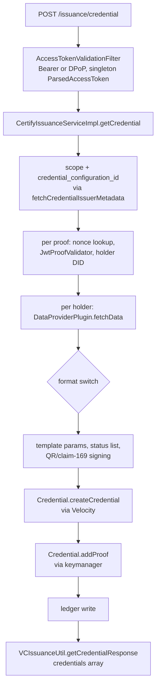

# Architecture as built on develop

> Part of the Inji Certify extensibility design. Baseline: `develop` at `a1cfd63` (1.0.0-beta.1-SNAPSHOT). Index: [README.md](./README.md).

Three Maven modules in one Spring Boot process (`certify-service` 12,347 lines, `certify-core` 2,844, `certify-integration-api` 294); `mosip.certify.plugin-mode` picks one of two `VCIssuanceService` beans at boot, and in DataProvider mode every credential passes through one Velocity template and one keymanager call per signature.

| Module | Holds | Notes |
| --- | --- | --- |
| `certify-integration-api` | `VCIssuancePlugin`, `DataProviderPlugin`, `AuditPlugin`; `VCRequestDto`, `VCResult` | `VCIssuancePlugin` returns a danubetech `JsonLDObject` |
| `certify-core` | 8 service interfaces, 50 DTOs, constants, exceptions, cache config | DTOs are the 1.0 wire shape |
| `certify-service` | 10 controllers, 22 services, 3 format classes, 8 LD proof generators, 6 proof classes, `DpopProofValidator`, `StaticContextLoader`, 7 JPA entities, utils | All behaviour |
| `certify-service-with-plugins` | Dockerfile layering plugin jars | No code |
| `db_scripts`, `db_upgrade_script/inji_certify` | psql DDL for 15 tables; `0.14.0_to_1.0.0_upgrade.sql` and rollback | No migration tool |
| `api-test` | TestNG regression rig (4,691 lines) | Runs from `push-trigger.yml` |

The credential request in DataProvider mode on develop:

Every box from C to L is one class or one static utility; the format decision at G is repeated in H, I, J and L; and the loop over proofs at E calls `fetchData` once per holder key.

| Class | Lines | Responsibilities today |
| --- | --- | --- |
| `CertifyIssuanceServiceImpl` | 435 | Scope and configuration match, proofs loop with nonce checks and audit, data fetch, format switch, template params and expiry, QR signing, status list entry, ledger write, signing dispatch |
| `VCIssuanceServiceImpl` | 183 | The same first half, then a format switch into `VCIssuancePlugin` (`ldp_vc`, `mso_mdoc` only) |
| `VelocityTemplatingEngineImpl` | 284 | Render; parse the `type::context::format` key; load and cache `CredentialConfig`; 9 config getters; post-inject `id`, `credentialStatus`, `vct`, `cnf`, `iss`, render-method digest |
| `Credential`, `W3CJsonLD`, `SDJWT`, `MDocCredential` | 529 | Per-format build and sign, each calling keymanager directly |
| `CredentialConfigurationServiceImpl` | 447 | Config CRUD, per-format validation, key-alias validation, issuer metadata with `credential_metadata` and COSE integers |
| `DpopProofValidator`, `AccessTokenValidationFilter` | 750 | Token decode, scheme binding, DPoP proof rules, `jti` replay cache |
| `JwtProofValidator` | 195 | The only proof type; did:jwk and did:key resolution by `kid` prefix |
| `IarServiceImpl`, `IarPresentationService`, `IarVpRequestService`, `PreAuthorizedCodeService`, `AccessTokenJwtUtil` | 1,528 | Embedded authorization server: pre-authorized code, interactive authorization endpoint over `verify-core`, token minting |
| `StatusListCredentialService`, `StatusListUpdateBatchJob` | 559 | Bitstring status list generation, index allocation, re-signing |
| `StaticContextLoader` | 373 | JSON-LD document loader with cache and host allow-list |

The rest of the HTTP surface is thin: `/credential-configurations` CRUD; `/.well-known/openid-credential-issuer`, `did.json`, `jwks.json`, `oauth-authorization-server`; `/nonce`; `/oauth/iae`, `/oauth/token`, `/pre-authorized-data`, `/credential-offer-data/{id}`; `/credentials/status`, `/credentials/status-list/{id}`; `/ledger-search`; `/rendering-template/{id}`; `/system-info/*`. Persistence is 15 PostgreSQL tables: 8 owned by Certify, 4 by the keymanager library, 3 by `verify-core`.
