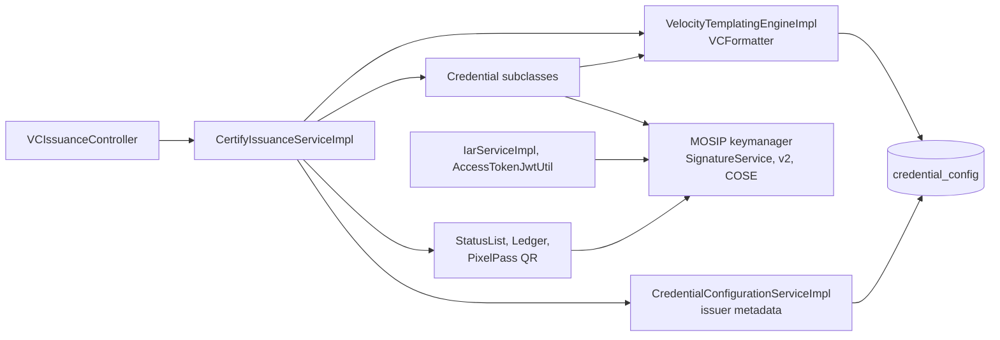

# Coupling findings

> Part of the Inji Certify extensibility design. Baseline: `develop` at `a1cfd63` (1.0.0-beta.1-SNAPSHOT). Index: [README.md](./README.md).

Twelve couplings explain why every extension touches the same files. Paths are under `certify-service/src/main/java/io/mosip/certify` at commit `a1cfd63`.

The template engine is the only path to configuration, keymanager is reached from five directions, and nothing sits between the HTTP layer and storage.

| # | Coupling | Evidence | What it blocks |
| --- | --- | --- | --- |
| 1 | One method orchestrates issuance end to end | `CertifyIssuanceServiceImpl.java:133-215` (`getCredential`: scope, proofs loop, nonce, audit), `:223-358` (`getVerifiableCredential`), `:360-435` (`signQrEntries`); the first half is duplicated in `VCIssuanceServiceImpl.java:55-140` | Deferred, batch, notification, encryption and any new step land in the same method, twice |
| 2 | Format is a string switched in 8 places | `CertifyIssuanceServiceImpl.java:238-275`; `VCIssuanceServiceImpl.java:156-170`; `VCIssuanceUtil.java:91-117`, `:148-152`; `CredentialConfigurationServiceImpl.java:123-150`, `:400-412`; `VelocityTemplatingEngineImpl.java:83-106`; `CredentialUtils.java:37-54`; three partial unique indexes in `certify-credential_config.sql` | A format is DDL, validator, mapper, index, metadata and four switches; `jwt_vc_json` was dropped rather than carried |
| 3 | Template engine is also the config repository and key chooser | `VCFormatter.java`: 11 methods, 9 are config getters keyed by a `type::context::format` string; `VelocityTemplatingEngineImpl.java:75-121` parses the key per format; `:243-254` post-injects `id`, `credentialStatus`, `vct`, `cnf`, `iss`; `Credential.java:42-45` requires a `VCFormatter` in every format class | A second template engine, a non-templated format, per-config key selection |
| 4 | Signing bound to keymanager from 20 call sites in 12 classes | `Credential.java:109` (`jwsSign`), `:139` (`cwtSign`); `SDJWT.java:140` (`jwsSignV2`, `typ` hard-coded at `:129`); `W3CJsonLD.java:92-150` picks a per-suite `ProofGenerator` (four call `jwsSign`, two call `signv2`) or `KeymanagerByteSigner.java:67`; `MDocProcessor.signMSO` (`coseSign1`); `AccessTokenJwtUtil.java:126`; `key-alias-mapper` is `@Value`-injected in 5 classes; `AppConfig.java:131-162` pre-creates fixed `CERTIFY_VC_SIGN_*` keys only in DataProvider mode; `JwksServiceImpl.java:58-72` and `DIDDocumentUtil.java:289-291` each re-derive public keys from certificates, the second via `credentialConfigRepository.findAll()` | Any non-keymanager key store, per-issuer keys, rotation, `x5c`/`kid` policy, signing outside the Spring service |
| 5 | Protocol version was replaced, not layered | `CredentialRequest.java:22-38` requires `credential_configuration_id`; `ProofType.java:5-6` allows `JWT` only and `proofs` is `Map<ProofType, List<String>>`, so `ldp_vp` object proofs cannot be carried; `allow-c-nonce` is a global switch; `credential_endpoint` is fixed at `:386-388`; no `credential_identifier`, `transaction_id`, `notification_id` or encryption fields | Draft-13 wallets; two versions side by side; the remaining 1.0 features |
| 6 | Nonce and proof handling has no seam | `NonceServiceImpl.java:31-33` mints a UUID; the transaction lives only in cache (`VCICacheService.java:80-92`) and is not consumed on use; `JwtProofValidator.java:187-195` picks the key resolver by `kid` prefix; `:184` leaves `x5c` and `trust_chain` as a TODO; no `key_attestation` | HAIP key attestation, `x5c` holder keys, CWT and LDP-VP proofs, single-use nonces across replicas |
| 7 | `credential_config` is a union of every format | `CredentialConfig.java` stores `context` and `credentialType` as sorted comma strings (`CredentialConfigMapper.java:60-68`) beside `docType`, `sdJwtVct`, `claims`, `msoMdocClaims`, `sdJwtClaims`, `sdClaim`, `qrSettings`; `CredentialConfigurationServiceImpl.java:105-107` copies global binding, signing and proof-type properties into each row at create time; `plugin_configurations` is never read | A new format is a schema change; global property changes do not reach existing rows |
| 8 | Issuer metadata is rebuilt per credential request | `CertifyIssuanceServiceImpl.java:142` calls `fetchCredentialIssuerMetadata()`, which runs `findAll()` (`CredentialConfigurationServiceImpl.java:303-304`) with no `@Cacheable` although `issuerMetadataCache` is configured; `did.json` also runs `findAll()` | Domain lookup depends on one protocol's wire DTO; cost grows with configuration count |
| 9 | Request state in a singleton | `ParsedAccessToken` is a singleton `@Component` written by `AccessTokenValidationFilter.java:140-143`; `shouldNotFilter` `:112-115` is an exact-path allow-list from `mosip.certify.authn.filter-urls`; `PreAuthIssuanceServiceImpl` reads it as a `DataProviderPlugin` | A second credential endpoint, VC-API, batch, async and CLI paths; thread safety with `@EnableAsync` |
| 10 | Embedded AS and `verify-core` entangled with the issuer | `IarServiceImpl`, `IarPresentationService`, `IarVpRequestService` import `io.inji.verify.services.*` and `io.inji.verify.dto.dcql`; three verify tables live in the `certify` schema; `AccessTokenJwtUtil` signs tokens with the same keymanager key; `PreAuthIssuanceServiceImpl` plugs the AS into the data-provider slot | Running behind an external AS only; splitting AS from issuer; HAIP's PAR and wallet attestation |
| 11 | Side effects inline and mutating plugin data | `addCredentialStatus(jsonObject, …)` `:245-253` edits fetched JSON before templating, only for `ldp_vc` + VC 2.0; QR `:309-329`; ledger `:332-343`; `jsonObject.remove(credentialStatus)` `:346` | Token Status List for SD-JWT and mDoc, notification bookkeeping, audit and webhooks as plugins |
| 12 | Plugin SPI is format-shaped and leaks library types | `VCIssuancePlugin.java:31-42` splits two methods by return type and exposes danubetech `JsonLDObject`; `VCRequestDto` is a union of format fields; `DataProviderPlugin.fetchData(Map)` receives raw token claims plus an injected `accessTokenHash` (`:224`); one bean per deployment via `scan-base-package` | Several data sources per issuer, per-config plugin selection, SPI versioning |

Tests match the shape: 76 Mockito-style unit test classes, a TestNG `api-test` rig, a 26-scenario DPoP Postman suite, no architecture rules, no plugin contract tests, no conformance run.
