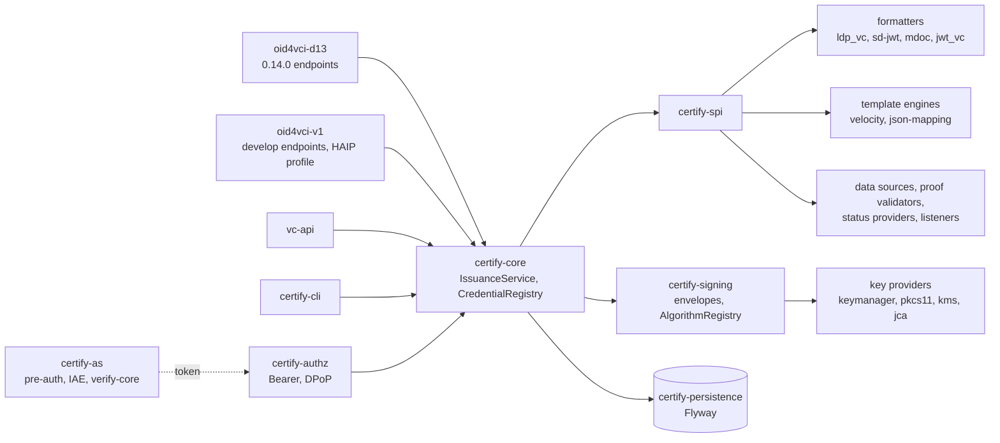

# Target architecture

> Part of the Inji Certify extensibility design. Baseline: `develop` at `a1cfd63` (1.0.0-beta.1-SNAPSHOT). Index: [README.md](./README.md).

A hexagonal core with one `IssuanceService.issue(IssuanceCommand)` operation, protocol adapters on the outside, every varying concern behind an SPI in its own module, and a signing-and-formatting library that runs without Spring Web, JPA or a live service so the same code serves the HTTP issuer and a command-line tool. The core imports no Spring Web, JPA, keymanager, Velocity or danubetech types.



Arrows point inward only: adapters and the CLI know the core, the core knows the SPI and the signing library, key providers and formatters know nothing above them.

| Module | Contains | May depend on |
| --- | --- | --- |
| `certify-spi` | The interfaces and value types in the sketch below; semver-versioned, published for plugin authors | JDK only |
| `certify-signing` | `KeyProvider` and `Signer` contracts, envelope builders (JWS, COSE\_Sign1, CWT, Data Integrity, legacy LD suites), `AlgorithmRegistry`, `KidStrategy`, `KeyPublisher` (JWKS and DID document) | `certify-spi`, nimbus, danubetech, BouncyCastle |
| `certify-keyprovider-keymanager`, `-pkcs11`, `-jca`, `-kms-*` | One `KeyProvider` + `Signer` each; keymanager is the default and the only one that needs keymanager's own JPA tables | `certify-signing` |
| `certify-core` | `IssuanceService`, `CredentialRegistry`, `CredentialConfiguration` model, `IssuanceContext`, ports for nonce, transaction and configuration storage | `certify-spi`, `certify-signing` |
| `certify-format-ldp-vc`, `-sd-jwt`, `-mdoc`, `-jwt-vc` | One `CredentialFormatter` each, owning envelope, request validation, metadata fragment, config schema | `certify-spi`, `certify-signing` |
| `certify-template-velocity`, `certify-template-jsonmap` | `TemplateEngine` implementations | `certify-spi` |
| `certify-persistence` | JPA entities, repositories, Flyway migrations, storage-port implementations | `certify-core` |
| `certify-authz` | Token validation into a request-scoped `AuthorizationContext`; Bearer and DPoP (moved from `filter/` and `dpop/`); scope and `authorization_details` policy | `certify-core` |
| `certify-protocol-oid4vci-d13` | The 0.14.0 controllers, DTOs, `?version=` converters and nonce-in-error behaviour, restored from `e54539a` | `certify-core`, `certify-authz` |
| `certify-protocol-oid4vci-v1` | Develop's controllers and DTOs moved out of `certify-core`; nonce, deferred and notification endpoints; encryption; a `profile=haip` switch | `certify-core`, `certify-authz` |
| `certify-protocol-vcapi` | `/vc-api/credentials/issue`, `/vc-api/credentials/status`; client-credential auth | `certify-core` |
| `certify-as` | Pre-authorized code, IAE over `verify-core`, token endpoint, AS metadata; later PAR and wallet attestation; owns the verify tables | `certify-core`, `certify-persistence`, `verify-core` |
| `certify-cli` | picocli commands `sign`, `issue`, `batch`, `keys`, `verify` over the same core and providers | `certify-core`, formatters, key providers |
| `certify-integration-api` (kept) | Old `DataProviderPlugin`, `VCIssuancePlugin`, `AuditPlugin` plus adapters into the new SPI | `certify-spi` |
| `certify-app` | Spring Boot assembly, plugin discovery, property aliases | everything |

The SPI, sketched:

```java
// certify-spi
public interface CredentialFormatter {
    String formatId();                                   // "ldp_vc", "dc+sd-jwt", "mso_mdoc", "jwt_vc_json"
    Set<String> aliases();                               // {"vc+sd-jwt"}: accepted, never advertised
    FormatConfig parseConfig(Map<String, Object> raw);   // typed and validated per format
    Map<String, Object> metadataFragment(CredentialConfiguration cfg, ProtocolVersion v);
    UnsignedCredential build(ClaimSet claims, CredentialConfiguration cfg, IssuanceContext ctx);
    IssuedCredential sign(UnsignedCredential c, SigningContext signing);   // envelope builders from certify-signing
}

public interface KeyProvider {
    String id();                                         // "keymanager", "pkcs11", "jca", "aws-kms", "vault"
    SigningKey resolve(KeyRef ref);                      // ref = provider + alias (+ version)
    List<PublicKeyDescriptor> publicKeys(KeyFilter f);   // kid, jwk, x5c, alg, validity, purpose
    Set<SignatureAlgorithm> supportedAlgorithms();
    default void ensureKeys(List<KeyRequirement> req) {} // bootstrap; replaces AppConfig.initKeys
}

public interface Signer {
    byte[] signRaw(byte[] data, SigningKey key, SignatureAlgorithm alg);       // every provider
    default Optional<String> signJws(JwsInput in, SigningKey key) { return Optional.empty(); }   // provider-native, optional
    default Optional<byte[]> signCose(CoseInput in, SigningKey key) { return Optional.empty(); }
}

public interface CredentialDataSource {
    String id();
    ClaimSet fetch(IssuanceContext ctx, CredentialConfiguration cfg) throws DataSourceException;
}

public interface ExternalIssuer {                        // successor of VCIssuancePlugin
    IssuedCredential issue(IssuanceContext ctx, CredentialConfiguration cfg);
}

public interface ProofValidator {
    String proofType();                                  // "jwt", "cwt", "ldp_vp", "attestation"
    HolderBinding validate(ProofInput proof, ProofPolicy policy, NonceCheck nonce);
}

public interface StatusProvider {
    String mechanism();                                  // "BitstringStatusList", "TokenStatusList"
    UnsignedCredential attach(UnsignedCredential c, CredentialConfiguration cfg);
    void update(StatusUpdate update);
}

public interface TemplateEngine {
    String id();                                         // "velocity", "jsonmap"
    RenderedDocument render(TemplateSource template, TemplateModel model);
}

public interface IssuanceListener {
    default void beforeSign(UnsignedCredential c, IssuanceContext ctx) {}
    default void onIssued(IssuanceEvent e) {}
    default void onFailed(IssuanceFailure f) {}
}

// certify-core
public record IssuanceCommand(String credentialConfigurationId,
                              AuthorizationContext authz,                       // NONE for CLI and VC-API
                              List<ProofInput> proofs,
                              Optional<Map<String, Object>> suppliedCredential,   // VC-API and `certify sign`
                              Map<String, Object> protocolParams) {}

public sealed interface IssuanceResult permits Issued, Deferred {}
```

`HolderBinding` is Certify's own type (`kind` = DID, JWK, COSE\_KEY or NONE; `value`; `kid`), so no nimbus or danubetech class crosses the SPI. `ClaimSet` is a map plus provenance metadata. `KeyRef` is opaque to the core; the keymanager provider maps it to today's `appId`/`refId`.

The core flow, in order:

1. `CredentialRegistry.resolve(command)` returns one `CredentialConfiguration` by id, or by (format, selector) for draft-13 requests.
2. `AuthorizationPolicy.check(authz, cfg)` enforces scope or `authorization_details`; `NONE` is accepted only for adapters that declare their own auth (VC-API client credentials, CLI).
3. For each proof, the `ProofValidator` for its type returns a `HolderBinding`; nonce checking is a strategy the adapter injects (token-carried for draft 13, nonce endpoint for 1.0).
4. Strategy from the configuration: `TEMPLATE` (data source, template engine, formatter build), `EXTERNAL` (`ExternalIssuer`), or `SUPPLIED` (payload straight to the formatter).
5. `StatusProvider.attach` when the configuration names a status mechanism.
6. `IssuanceListener.beforeSign` (QR/claim-169 and render-method digest live here, not in the core).
7. `formatter.sign(unsigned, SigningContext.of(cfg.signing(), keyProvider, signer))`.
8. `IssuanceListener.onIssued` (ledger, audit, notification bookkeeping), then `IssuanceResult` with one `IssuedCredential` per holder binding.

The domain configuration model replaces the union entity:

```java
public record CredentialConfiguration(
    String tenantId,                 // "default" until a TenantResolver says otherwise
    String id,                       // today's credential_config_key_id
    String scope,
    String format,                   // canonical formatter id
    FormatConfig formatConfig,       // typed by the formatter: context+types, vct, doctype, claims, sdClaims
    TemplateRef template,            // engine + template id + mode (FULL_DOCUMENT | CLAIMS_ONLY | NONE)
    SigningConfig signing,           // KeyRef + alg + cryptosuite + header policy; no appId/refId
    IssuanceStrategy strategy,       // TEMPLATE | EXTERNAL | SUPPLIED, plus dataSourceId
    StatusConfig status,             // mechanism + purposes, or none
    DisplayConfig display,
    Map<ProtocolVersion, Map<String, Object>> protocolOverrides) {}
```

Tenant-ready, single-tenant by default. Every core operation carries a `TenantContext` (`tenantId`, `credential_issuer`, issuer DID, default key namespace) resolved by a `TenantResolver` SPI whose default implementation always answers `default`. `CredentialRegistry`, `KeyRef`, caches, `IssuanceContext`, the ledger and status ports and every adapter's metadata renderer are keyed by tenant from the start, so enabling multi-tenancy later means configuring a resolver (by host name, a `/t/{tenant}` path prefix, or the issuer identifier) and adding per-tenant values for the properties that are global today (`domain.url`, `did-url`, `authn.issuer-uri`, `authn.allowed-audiences`, issuer display, key aliases). Nothing changes shape for a single-tenant deployment; a tenant-specific `credential_issuer` yields a tenant-specific `.well-known` document. Isolation beyond a discriminator column (schema per tenant, database per tenant) stays reachable through Hibernate's multi-tenancy strategies without touching entities, because no entity embeds the tenant in its identity.

Protocol adapters and mounting:

| Adapter | Mount | Notes |
| --- | --- | --- |
| `oid4vci-v1` | New issuer identifier `{domain}{servletPath}/oid4vci` with `/oid4vci/credential`, `/oid4vci/nonce`, `/oid4vci/deferred_credential`, `/oid4vci/notification` and its own metadata document; the same adapter also serves today's `/issuance/credential` and `/nonce` in compatibility mode, deprecated | The clean surface is where new features and `profile=haip` land; the compatibility mode is the same code with the old DTO names |
| `oid4vci-d13` | Today's `/issuance/credential` accepting the 0.14.0 body, \`/issuance/vd11 | vd12/credential` ,  `/.well-known/openid-credential-issuer?version=` ;  `credential\_issuer\` unchanged; on by default, deprecated from day one |
| `vc-api` | `/vc-api/credentials/issue`, `/vc-api/credentials/status` | Namespaced to avoid the existing `POST /credentials/status` |
| `certify-as` | Unchanged `/oauth/*`, `/pre-authorized-data`, `/credential-offer-data/{id}` | Same JVM or split; the issuer never reads AS caches directly |
| `certify-cli` | No HTTP; `certify sign`, `certify issue`, `certify batch`, `certify keys`, `certify verify` | Builds `IssuanceCommand` with `AuthorizationContext.NONE` and an in-memory or database-backed registry |

Plugin loading and SPI versioning: implementations are discovered through Spring `AutoConfiguration.imports` (or `ServiceLoader` for non-Spring jars and the CLI) instead of `scan-base-package`; `certify-spi` follows semver with `@since` on every method; `certify-integration-api` stays published and its `LegacyDataProviderAdapter` and `LegacyExternalIssuerAdapter` wrap old plugins for at least two minor releases.

Rules to enforce with ArchUnit from Phase 0: `certify-core` and `certify-signing` have no dependency on `org.springframework.web`, `jakarta.servlet`, `jakarta.persistence`, `org.apache.velocity`; `io.mosip.kernel` is referenced only inside `certify-keyprovider-keymanager`; `com.danubetech` and `foundation.identity` only inside `certify-signing` and `certify-format-ldp-vc`; adapters depend only on `certify-core` and `certify-authz`; `VCFormats` constants only inside `certify-spi` and formatter modules.
