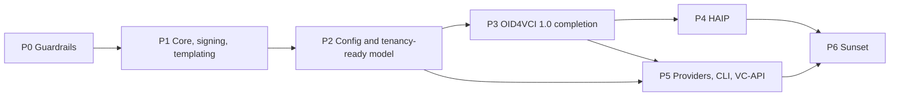

# Phased roadmap

> Part of the Inji Certify extensibility design. Baseline: `develop` at `a1cfd63` (1.0.0-beta.1-SNAPSHOT). Index: [README.md](./README.md).

Seven phases on develop's `1.0.0-beta.1` line, each shippable behind the existing API; Phase 1 changes no wire bytes, no endpoint and no table, and everything new arrives from Phase 3. Effort figures are rough estimates in engineer-weeks for a team of two to three who know the code.

| Phase | Release | Work packages | Exit criteria | Effort |
| --- | --- | --- | --- | --- |
| P0 Guardrails | 1.0.0 | Golden request/response files from develop and from 0.14.0; golden signature vectors per signing path; Flyway baseline with per-module locations; Testcontainers PostgreSQL; ArchUnit module; request-scoped `AuthorizationContext` with `ParsedAccessToken` as a delegating shim; `CredentialRegistry` read path and metadata cache replacing per-request `findAll()`; deprecation header, counter and kill-switch infrastructure; `certify-signing` skeleton with the `jca` provider | Golden tests green; Flyway adopts a develop database with no diff; no wallet-visible change | 3 to 4 |
| P1 Core, signing, templating | 1.0.0 or 1.1.0 | `certify-spi` and `certify-core`; `CredentialFormatter` for `ldp_vc`, `dc+sd-jwt` (with `vc+sd-jwt` alias) and `mso_mdoc` moved out of the `Credential` classes; `TemplateEngine` (Velocity, `FULL_DOCUMENT`) with post-injection moved into formatters; `certify-keyprovider-keymanager` owning the keymanager wiring, all seven paths through the envelope builders; `KeyPublisher` for JWKS and `did.json`; `ProofValidator` returning `HolderBinding`; listeners for ledger, audit, QR and render-method digest; Bitstring `StatusProvider`; `oid4vci-v1` adapter from develop's controllers; `oid4vci-d13` adapter restored from `e54539a`; both `*IssuanceServiceImpl` deleted; legacy plugin adapters; `certify sign` and `certify keys` minimal CLI | Both golden sets and signature vectors unchanged; `api-test` passes in both plugin modes; zero DB change; the service boots with the keymanager provider exactly as today | 8 to 10 |
| P2 Config and tenancy-ready model | 1.1.0 | Migration with JSONB columns, `credential_template`, `issuance_transaction`, `ledger` columns and `tenant_id` columns with rebuilt unique indexes; `TenantResolver` with the `default` implementation; registry reads JSONB; per-configuration `issuance_strategy`, `signing_config`, `template`; `/v2/credential-configurations` with typed `FormatConfig` and `/preview`; v1 dual-write with the `credentialSubjectDefinition` alias; global metadata properties merged at render time | Mixed-strategy deployment test passes; upgrade and rollback rehearsed on 0.14.0 and develop dumps; single-tenant behaviour unchanged | 4 to 5 |
| P3 OpenID4VCI 1.0 completion | 1.1.0 or 1.2.0 | `credential_identifier` with `authorization_details`; `proofs.attestation` and `ldp_vp` carried and validated; `key_attestation`; deferred issuance and `notification_endpoint` on `issuance_transaction`; `batch_credential_issuance`; response encryption; single-use nonces (Redis or the `nonce` table); conformance job in CI | OpenID Foundation suite green for the chosen 1.0 plan | 5 to 6 |
| P4 HAIP | 1.2.0 | PAR and wallet attestation in `certify-as` or a written external-AS contract; `profile=haip` restricting formats, algorithms and header policy (`x5c` for SD-JWT issuer keys); non-mock `mso_mdoc` with IACA chains from `ca_cert_store` or `trust_anchor` | HAIP conformance plan green | 4 to 5 |
| P5 Providers, CLI, VC-API, unification | 1.2.0 or 1.3.0 | PKCS#11 provider and one cloud KMS provider; `certify issue`, `certify batch`, `certify template render`, `certify verify`; `certify-protocol-vcapi` with the `SUPPLIED` strategy and client-credential auth; `ExternalIssuer` final with `VCIssuancePlugin` as adapter only; Token Status List provider; `jsonmap` template engine and `CLAIMS_ONLY` mode with output schemas; plugin discovery via `AutoConfiguration.imports`; `certify-spi-testkit` | W3C CCG issuer suite green; a credential signed by the CLI with a PKCS#12 key verifies with the same verifier as a service-issued one; a plugin from `digital-credential-plugins` runs unmodified through the legacy adapter, then again after migrating to the new SPI | 6 to 8 |
| P6 Sunset | 2.0.0 | Remove the draft-13 adapter's deprecated paths if counters are zero, `/oauth/iar` alias, v1 config API, `plugin-mode`, `filter-urls`, property aliases, legacy plugin adapters; drop legacy `credential_config` columns; make keymanager and verify tables optional in the shipped DDL; deprecate `FULL_DOCUMENT` templates once every shipped sample has a `CLAIMS_ONLY` equivalent | Counters at zero for one release before each removal | 2 to 3 |

Ordering rules: P0 lands before any refactor PR; P1 is a sequence of small PRs, each keeping both golden sets and the signature vectors green; the keymanager provider module is extracted first inside P1 so every later PR runs against it; P2 puts `tenant_id` and the JSONB columns in one migration so indexes are rebuilt once; P3 and P5 share `issuance_transaction` and the nonce store, so P5 starts only after P3's schema is merged; P6 removes nothing whose replacement is younger than two minor releases.
