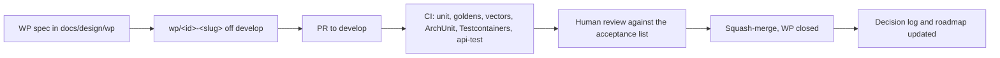

# Automated development

> Part of the Inji Certify extensibility design. Baseline: `develop` at `a1cfd63`. Index: [README.md](./README.md).

The rebuild is executed as a stream of small, independently mergeable work packages (WPs), each with a written spec, an acceptance list and the same three safety nets: golden wire tests, signature vectors and ArchUnit rules. Agents pick WPs, humans take decisions and review; nothing merges that changes wire bytes before Phase 3.

## Operating model

- One agent per WP, one WP per branch, one PR per WP. A WP that grows past roughly 800 changed lines (excluding recorded goldens and generated SQL) is split, not merged.
- PRs target `develop` directly. Phase 1 is safe to land incrementally because every PR must keep both golden sets and the signature vectors green; if a WP cannot keep them green it is wrong, not the tests.
- Agents run independently only on WPs whose dependencies are merged. The dependency field in each spec is authoritative.
- Every WP that takes a decision not already in `12-risks-and-decisions.md` stops and asks; the answer is appended to the decision log before the PR is opened.

## Gates a PR must pass

| Gate | What it runs | Introduced by |
| --- | --- | --- |
| Unit and component tests | `mvn -B test` across modules | today |
| Golden wire tests | `GoldenReplayTest` for v1 (and d13 once WP1-10 lands) | P0-01, P0-02 |
| Signature vectors | `SignatureVectorTest` | P0-03 |
| Architecture rules | ArchUnit with a frozen violation list that may only shrink | P0-06 |
| Database | Testcontainers PostgreSQL, Flyway chain on a fresh DB and on a develop dump | P0-04, P0-05 |
| DPoP suite | Newman run of the 26-scenario collection | P0 CI WP |
| Regression | existing `api-test` rig | today |
| Conformance (nightly) | OpenID Foundation suite, W3C CCG VC-API suite | P3, P5 |

## The agent contract

Every WP spec contains: goal, scope (in and out), acceptance criteria as a checklist, dependencies, size (S under 2 days, M under 5, L split it). An agent working a WP:

1. Reads `CLAUDE.md`, `docs/design/05-target-architecture.md`, the design section that owns the WP, and the spec.
2. Creates `wp/<id>-<slug>` from the current `develop`.
3. Writes or extends tests first when the WP changes behaviour-adjacent code; records goldens or vectors before touching the code they protect.
4. Keeps changes inside the files the spec names; anything else is listed in the PR description under "Outside scope".
5. Runs the full gate list locally (`mvn -B verify -Pgoldens,archunit,testcontainers`) before opening the PR.
6. Opens the PR with the acceptance checklist copied into the description and each item ticked with evidence (test name, command output).
7. Appends to the decision log when a choice was made, and to `docs/technical_docs/Releases.md` when a deprecation or property alias was added.

## Work packages by phase

Phase 0 specs are written and live in [wp/](./wp/): P0-01 goldens (v1), P0-02 goldens (draft 13), P0-03 signature vectors, P0-04 Flyway baseline, P0-05 Testcontainers, P0-06 ArchUnit, P0-07 AuthorizationContext, P0-08 CredentialRegistry, P0-09 deprecation infrastructure, P0-10 signing skeleton with the jca provider. P0-01, P0-03, P0-04, P0-06, P0-09 have no dependencies and can start in parallel.

Phase 1 WPs (specs to be written when Phase 0 is half merged, in this order): P1-01 `certify-spi` and `certify-core` with `IssuanceCommand`, `IssuanceResult`, `IssuanceContext`, `HolderBinding`, `ClaimSet`; P1-02 `certify-keyprovider-keymanager` extraction (component scan, JPA config, `initKeys` as `ensureKeys`); P1-03 route the seven signing paths through the envelope builders (vectors green); P1-04 `KeyPublisher` behind JWKS and `did.json`; P1-05 `ldp_vc` formatter; P1-06 `dc+sd-jwt` formatter with the `vc+sd-jwt` alias; P1-07 `mso_mdoc` formatter; P1-08 `TemplateEngine` (Velocity) and registry getters, post-injection moved into formatters; P1-09 `ProofValidator` returning `HolderBinding`; P1-10 listeners (ledger, audit, QR, render digest) and the Bitstring `StatusProvider`; P1-11 `oid4vci-v1` adapter from develop's controllers; P1-12 `oid4vci-d13` adapter restored from `e54539a` (enables the d13 goldens); P1-13 delete both `*IssuanceServiceImpl`, legacy plugin adapters; P1-14 `certify-cli` with `sign` and `keys`.

Phases 2 to 6 follow [11-roadmap.md](./11-roadmap.md); their specs are written at the end of the preceding phase, because their file lists depend on what Phase 1 produced.

## Human checkpoints

| When | Who decides | What |
| --- | --- | --- |
| Before P1 starts | project owner | The open decisions in `12-risks-and-decisions.md` marked "before P1" |
| End of each phase | project owner and one maintainer | Exit criteria met; frozen ArchUnit list shrank; deprecation counters reviewed |
| Any PR touching `certify-keyprovider-keymanager`, migrations or `certify-spi` | maintainer | Compatibility review against `09-api-compatibility.md` |

## Metrics to watch

Frozen ArchUnit violations (must trend to zero by the end of Phase 1), golden case count per adapter, signature vector count (seven paths, all green), `certify.deprecated.calls` per endpoint (must reach zero before a removal), Flyway chain length and migration time on the largest known dump.
